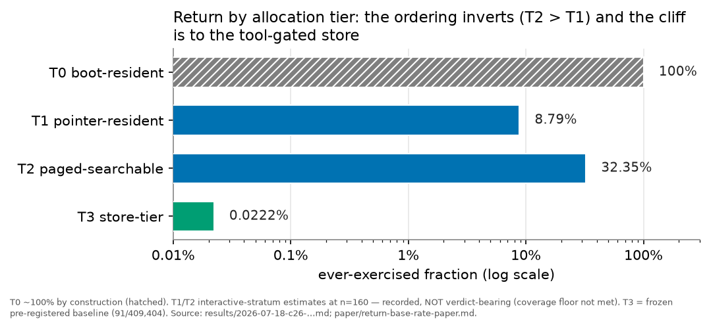
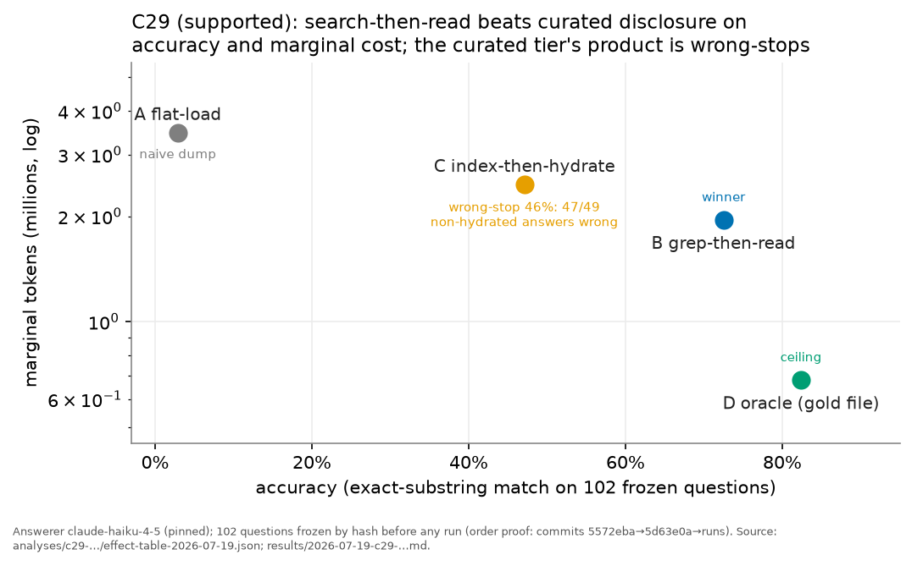

# Agent Memory Allocation: Tiers and Policies of Effective Agent Memory

**Rashid Azarang**

*Independent Researcher — San Pedro Garza García, Nuevo León, Mexico*
*rashid@mentu.ai · rashidazarang.com · ORCID [0009-0008-5528-4246](https://orcid.org/0009-0008-5528-4246)*

**Preprint — 2026-08-14.** This text supersedes earlier drafts, whose texts
stand unchanged in the `epistemics` research repository (`paper-v1.md`,
`paper-v1.1.md`), with every difference between them itemized in the change
documents that accompany this bundle (`CHANGES-v1.1.md`, `CHANGES-v1.2.md`,
`CHANGES-v2.md`). It responds to two
commissioned adversarial reviews (`EXTERNAL-REVIEW-2026-07-22.md` and
`EXTERNAL-REVIEW-2026-08-12.md`, the second dispositioned finding by finding
in `DISPOSITION-2026-08-12.md`). No frozen conjecture, analyzer, results
document, or effect table was altered in any revision; the revisions re-report
what those artifacts already contain, at corrected prominence, and add
descriptive statistics computed from committed run records. Built from the
pre-registered falsification program
`docs/BUILD-agent-memory-allocation-v1.md` in the `epistemics` research
repository; §-content derives from that program's committed spine (see git
history of this file). A production client engagement referenced in §3/§6 is
generalized throughout as **Workspace-P** with its identity and contents
withheld; the confidentiality boundary and the data-release options are
documented in `SENSITIVITY-AUDIT.md` and §Data & artifact availability.

## Abstract

Agent memory is theorized and measured almost entirely at the context window.
Yet a deployed agent's *effective* memory spans several tiers — a boot-resident
image (contract files, skill and tool catalogs, memory indexes), pointer-
resident and paged-searchable filesystem content, and tool-gated stores — whose
relative utility has, to our knowledge, no published cross-tier measurement.
We make three contributions. First, we formalize agent memory as a set of
**tiers** characterized by capacity, access cost, persistence, addressability,
and staleness risk, governed by five **policies**: residency, paging,
promotion, eviction, validation. The policy names are borrowed from classical
cache and virtual-memory design (Smith 1982; Denning 1968, 1970); what the tier
formalization adds beyond that vocabulary is the content-versus-pointer
residency distinction and the staleness-risk property, which has no cache
analogue because cache paging is faithful and digest paging is lossy. Second, we
show the vocabulary expresses four existing systems (MemGPT, Pichay, the Claude
Code harness, and a production workspace) without a residual category, and that
the validation cell is empty for the two published systems we read. That is a
property of two selected neighbours, not of the literature: MemoryBank's
Ebbinghaus-inspired decay mechanism fills the same cell. Third, we run a
pre-registered falsification program over one single-operator agent ecosystem,
with predictions frozen and analyzers committed before any data were read. Its
results, each adjudicated mechanically against criteria fixed in advance:
promotion of a fact to the durable memory directory does **not** produce later
returns (2 of 157 eligible promoted files ever re-read — *refuted*); associative
search-then-read beats curated layered disclosure on accuracy (72.5% vs 47.1%,
+25.5 pp), on error rate (27.5% vs 52.9%), and on marginal token cost, while
costing 1.41× more on total tokens, the mechanism being that the authored index
routed the policy to the correct file on 52.0% of questions against
grep's 80.4% (*supported* on this corpus). **That finding has since been
replicated in public at power**: a pre-registered replication over 141
releasable documents and 120 frozen questions returns search **+12.5 pp** on
accuracy (63.3% vs 50.8%), a wrong-stop tax of 34.2% against 18.3% under a
*symmetric* rule the original lacked, and a localization advantage of 75.0%
against 62.5% — all three predictions passing, with the corpus, questions,
answers, harness and adjudicator shipped for re-running. Its overall verdict
is *revised*, on an orthogonal fifth prediction about token headroom that
failed on the harder of two measures (§6.5); the replication supersedes the
underpowered demonstrator, which adjudicates nothing (§7 Limits (b′)). And the
frame's own
residency-depth ordering is *inverted* in recorded-but-under-powered estimates,
where searchable content out-returns pointer-resident content, although a
post-hoc diagnostic shows that inversion is substantially carried by reads
performed by the sessions that were editing the files. We
report the negative, self-inverting, and self-correcting results as first-class,
and argue that the method, a rigorous instantiation of pre-registration and
mechanical adjudication in a systems setting, is itself a contribution.

**Keywords:** context engineering; agent memory; retrieval; progressive
disclosure; pre-registration; LLM agents.

*Discipline carried from the governing program and observed throughout: every
quantity cites a source path; no outcome of unadjudicated work is anticipated
(the covered C26/C27 re-runs, the registered-but-unadjudicated successor
conjectures c26b and c28b, and the candidate conjecture c30 are pre-judged
nowhere); no self-assigned quality score appears.*

---

## §1 Problem and motivating phenomenon

An agent's effective memory is not its context window. In deployed practice it
spans, at minimum: contract files loaded at session start (`CLAUDE.md`,
`AGENTS.md`), catalogs of skills and tool schemas listed in the system prompt,
durable memory directories with index files, workspace filesystems reachable by
search, and structured stores reachable only through tools. Every one of these
surfaces was invented ad hoc by practitioners; none of them is theorized in the
agent-memory literature, which manages and measures the context window
(MemGPT-style paging, compaction, context engineering) and the episodic store
(retrieval benchmarks), and stops there. The memory that is *configured before
any task arrives* — the boot image — carries a large share of the token budget.
Its *composition* has recently been surveyed at scale [10] and its *task
utility* measured [11] — the latter finding, convergently with our own results
below (§6.1), that repository-level context files frequently do not improve task
success while adding over 20% to inference cost. What remains unmeasured, to our
knowledge, is the boot image's **return rate under pre-registration**: whether
configured content is exercised at all, with the prediction frozen before the
probe.

The phenomenon that motivates this paper is a cliff, visible in a production
single-operator agent ecosystem once its endpoints are measured:

- **Boot-resident objects return in ~100% of sessions by construction** — the
  harness loads them every time.
- **Store-tier objects return organically at 0.0222%** — 91 of 409,404
  trust-state rows ever accessed after capture (`paper/return-base-rate-paper.md`,
  frozen result; preregistered, ledger-backed).

Between these endpoints sit the pointer-resident tier (indexed memory files,
skill bodies) and the paged-searchable tier (workspace notes and docs). Their
return rates were unmeasured before this program's probes (§6). The corpus to
measure them retroactively exists:
157 project directories, 453 promoted memory files, and the **2,337** session
transcripts admitted to the frozen measurement manifest, on the machine that
produced the store-tier baseline. (An earlier same-day raw file count under
different rules reports 2,368 `*.jsonl`, 1,798 from June and 570 from July;
`docs/BUILD-agent-memory-allocation-v1.md` §Grounding, census 2026-07-18, counts
only. The manifest additionally excluded 98 post-freeze transcripts and 1
program session. The residual 31-transcript difference between that census and
the manifest is not decomposed by any committed artifact; it is reported here
rather than reconciled, and every measurement in §6 uses the manifest's 2,337.)

The measurement gap is not an accident of youth. Read-side instrumentation has
been specified at least three times in this ecosystem's design record —
`last_accessed`/`access_count`/`reinforcement_score` in an epistemic-signal
schema (`mentu-physics/foundational/blueprint/ese/engine/foundations/`
`cir-memory-as-infrastructure.md`, 2025-06); `access_count` plus `fresh/stale`
status in a trail-handle schema (`mentu-physics/foundational/blueprint/heap/`
`heap/plan-july2025/progressive-intelligence.md`, 2025-07); `recordReturn`/
`recordUse` in store telemetry (`LACSEpistemicTelemetry.swift`, 2026) — and
none of the three has produced a dataset. The live store carries the first
schema's decay column (`decay_half_life_days`) and none of its access columns
(`docs/BUILD-agent-memory-allocation-v1.md` §Grounding, schema check
2026-07-18). Write-side telemetry ships; read-side telemetry stays specified.
Utilization measurement is systematically the unshipped half.

The same record shows the converse defect: policies get configured without the
measurement they presuppose. Usage-gated curation appears repeatedly as
designed policy — promotion at `access_count > 10`, extraction to a shared node
at `candidacy > 0.85`, metadata investment stepped at a ~200-line threshold
(paths in `docs/BUILD-agent-memory-allocation-v1.md` §Grounding) — and every
threshold is a guess, because the gauge that would set it was never built.
Designed gates, missing gauges. The governing program states the corrective
once — **gauges before gates**: measurement ships first, and no threshold is
recommended before the data that would justify it exists
(`docs/BUILD-agent-memory-allocation-v1.md` §Purpose).

If return falls by orders of magnitude with each step away from the boot image,
then the operative question of context engineering is not *how to retrieve well*
but *what earns which allocation* — and the field's central activities
(curating summaries, layering metadata, building stores) are investments whose
payoff term is multiplied by a return rate nobody has measured. This paper
supplies (a) a vocabulary in which the allocation question can be stated
precisely, (b) a demonstration that the vocabulary spans existing systems, and
(c) a pre-registered falsification program that measures the unmeasured tiers —
**with first results** (§6): one conjecture supported at full coverage, one
refuted, two instrument-insufficient with estimates on record, and one
descriptive census. It is not a system and not an architecture proposal; every
result it reports was adjudicated mechanically against criteria frozen before
any probe ran.

## §2 The frame

The encapsulation, stated once and used throughout:

> An agent's effective memory is a set of **tiers**, each with (capacity, access
> cost, persistence, addressability, staleness risk), governed by **five
> policies** — **residency** (what loads at boot), **paging** (what's fetched on
> demand), **promotion** (what graduates to durable memory), **eviction**
> (compaction), **validation** (staleness checks).

### §2.1 Tier properties

- **Capacity** — how much the tier can hold before its cost model changes
  (the window's is hard; a filesystem's is effectively unbounded).
- **Access cost** — tokens and steps to bring one object from this tier into
  the window (zero for resident content; one tool call plus content tokens for
  paged content; search cost plus content tokens for unindexed content).
- **Persistence** — whether the tier survives the session, the project, the
  machine.
- **Addressability** — what must be known to retrieve an object: nothing
  (resident), a pointer (indexed), a predicate (searchable), a tool contract
  (store).
- **Staleness risk** — the probability that the tier's representation of an
  object diverges from ground truth, and whether anything detects it.

### §2.2 The five policies

The five names are taken from classical cache and virtual-memory design and map
one-to-one onto its axes: residency onto placement and prefetch, paging onto
fetch policy (demand versus anticipatory), promotion onto write-allocate
placement, eviction onto replacement, validation onto coherence and
invalidation [14, 15, 16]. We state the correspondence rather than obscure it,
because the borrowing is the point of §4: the interesting content is where the
analogy breaks. Two things in the formalization below are **not** in that
vocabulary. The first is the split of residency into **content residency** and
**pointer residency**, which does measurable work in §6.2 and §6.3 and which
cache design has no occasion to draw, since a cache line is never a pointer to
its own contents. The second is **staleness risk** as a tier property (§2.1):
OS paging is faithful, so a cache has no notion of a resident representation
that silently misdescribes what it stands for, and validation in the OS sense is
coherence rather than truth maintenance (§4.2). Everything else in the list is a
renaming, and we do not claim otherwise.

- **Residency** — what is placed in the window at session start, before any
  task. Two forms with different economics: **content residency** (the object's
  full text is resident) and **pointer residency** (a name, one-line
  description, or index entry is resident; the content stays paged). Pointer
  residency is progressive disclosure, formalized: the resident pointer is the
  low-resolution representation; the paged body is the high-resolution one.
- **Paging** — how paged content reaches the window on demand. The agent pulls
  by two mechanisms: **pointer-follow** (resolve a resident pointer: read the
  indexed file, load the named skill) and **associative search**
  (grep/glob/semantic search over content that has no resident pointer). A
  third mechanism does not originate with the agent at all: **policy-push
  injection**, in which the harness itself writes content into the window at a
  lifecycle event (session start, prompt submission, after a tool result). This
  is the channel behind reminder-style memory recall — content that enters
  context with no Read event — and it is therefore invisible to any instrument
  that counts only agent-initiated reads. It is precisely the un-refuted half
  of C28 (§6.2) and the target of c28b — now a registered, forward-adjudicated
  successor conjecture (§6.2): our refutation measured the pull channel and
  found it dead; the push channel was never measured, and its dedicated
  instrument is content-fingerprint reuse rather than the injection event,
  which the harness does not reliably persist.
- **Promotion** — by what rule an object moves to a more durable, more
  reachable tier (a fact written to the memory directory and indexed; a note
  graduated into a tracking file).
- **Eviction** — by what rule objects leave a tier: deletion, FIFO drop, or
  **lossy digest** (compaction summarizes-then-drops; supersession marks
  non-current without deleting).
- **Validation** — by what rule the system detects that a stored
  representation no longer matches ground truth (age warnings, freshness
  fields, freeze-and-supersede conventions, or — commonly — nothing).

### §2.3 Canonical tiers

| Tier | Definition | Examples (this machine) |
|---|---|---|
| **T0 boot-resident** | auto-loaded every session | `CLAUDE.md`/`AGENTS.md` chain, `MEMORY.md` index body, system-prompt skill/tool listings |
| **T1 pointer-resident** | boot-resident pointer, content paged on demand | `memory/*.md` files, skill bodies, `catalog.json` targets |
| **T2 paged-searchable** | on disk in the workspace, no boot pointer | `notes/`, `docs/`, source files |
| **T3 store-tier** | reachable only through tools/DB | LACS handles, CIR signals |

Tier assignment classifies the *access surface*, not the object: a skill is a
T0 pointer (its catalog line) plus a T1 body. Classification rules for the
measurement program live in the committed analyzers, not in prose
(`docs/BUILD-agent-memory-allocation-v1.md`, Risks).

### §2.4 One objective, five corollaries

The five principles of the progressive-disclosure manifesto are facets of a
single decision problem: **sequential information acquisition under per-token
cost**. At each step, a policy holding a partial representation either stops
and acts, or pays to acquire a further representation. In that objective:

| Principle | Role in the objective |
|---|---|
| Progressive Disclosure | the action space — what may be acquired, in what order |
| Progressive Resolution | the representation invariant — each artifact exists at several costs |
| Demand-Driven Context | the policy class — sequential and adaptive, not batch |
| Context Budgeting | the cost term — every acquired token is charged |
| Hierarchical Relevance | the state update — re-score relevance after each acquisition |

The formal lineage is value of information (Howard 1966) and search with
inspection costs (Weitzman 1979): boxes with unknown prizes, an inspection fee
per box, and an index policy that is optimal under independence and known prize
distributions. We import this lineage as **vocabulary and metrics** —
inspection cost, reservation value, stopping rule, and regret against a
minimal sufficient context — and explicitly **not** as transferable optimality
theorems: a document DAG violates independence (contents are correlated),
prize distributions are unknown rather than known, inspections are not
exchangeable (reading one file changes the value of reading its neighbor), and
the cost of a resident token is an attention externality, not a scalar fee
(§4). Any claim of an optimal disclosure policy for real corpora would be
unearned; the usable imports are the metrics:

- **Minimal sufficient context** C*(τ): the smallest token set whose
  acquisition yields the correct decision for task τ at a stated confidence.
- **Overspend**: tokens acquired ÷ |C*(τ)|.
- **Wrong-stop**: acting on an insufficient representation (deciding from a
  summary whose body would have changed the decision).
- **Oracle regret**: cost difference between the policy and an oracle that
  acquires exactly C*(τ).

## §3 The load test: four systems, five policies

The frame earns its keep only if it expresses existing systems without a
residual column. Sources: MemGPT (arXiv:2310.08560) and the Letta
documentation; Pichay (arXiv:2603.09023); the Claude Code harness as documented
and operated on this machine; and **Workspace-P** — a production client
engagement whose identity and contents are withheld for third-party
confidentiality (§Data & artifact availability) — via its `AGENTS.md` contract
file (a six-layer memory table, 2026-07-02).

| Policy | MemGPT / Letta | Pichay (Mason 2026) | Claude Code harness | Workspace-P |
|---|---|---|---|---|
| **Residency** | main context: system instructions + writable working-context block (content residency) | L1 generation window + L2 fault-pinned working set (content residency) | `CLAUDE.md`/`AGENTS.md` content-resident; skill catalog + deferred-tool names + `MEMORY.md` index pointer-resident | `AGENTS.md` contract content-resident; `catalog.json` + the six-layer table pointer-resident |
| **Paging** | function-call retrieval from recall/archival storage (pointer-follow via search functions) | page-fault detection → retrieval handles resolve to backing content (pointer-follow) | `ToolSearch` schema load, skill-body load, memory-file `Read` (pointer-follow); `Grep`/`Glob` (associative search) | pointer-follow through catalog and layer table; grep across `children/` (associative search) |
| **Promotion** | self-directed writes to working context and archival storage | compaction of faulted content into L3 history / L4 cross-session store | memory-directory write + `MEMORY.md` index line | notes → `action-items.md` tracking rows; meeting notes → `notes/meetings/`; team-facing docs → the sovereign docs repo |
| **Eviction** | recursive summarization under context pressure; FIFO queue eviction (lossy digest + drop) | FIFO eviction from the window; compaction into L3 (lossy digest) | context compaction (lossy digest) | `congelado` freeze + dated-correction supersession (mark non-current, never delete) |
| **Validation** | none documented | none documented | age warnings injected when old memories are recalled; otherwise manual curation | frontmatter `status`/`updated` fields; freeze rule; an inventory/health script provides evidence |

Two observations the table forces, recorded here and carried to §7:

1. **The validation column is empty for the two published systems in this
   table, and that is a fact about the sample, not about the literature.** No
   validation policy appears in the MemGPT paper (arXiv:2310.08560), the Letta
   documentation, or Pichay (arXiv:2603.09023) as read on 2026-07-22. But the
   two systems here were selected as this frame's *architectural neighbours*,
   which is close to selecting for the null. Published memory systems do fill
   the cell: MemoryBank [17] carries an Ebbinghaus-inspired forgetting and
   reinforcement mechanism governing memory strength over elapsed time, which is
   a staleness policy and is closer to this estate's own live store (which
   carries `decay_half_life_days`, §1) than anything in MemGPT; Mem0 [18] runs
   an extraction-plus-consolidation stage over stored items; A-MEM [19] evolves
   links and updates memories as new items arrive; Generative Agents [20] carry
   recency-weighted retrieval and reflection. **An earlier draft read the empty column as
   "weak evidence the slot is real: practice invented validation before theory
   named it." That inference is withdrawn.** One published system filling the
   cell inverts it, and an n=2 sample chosen for architectural adjacency cannot
   carry a claim about what practice has or has not invented. What survives is
   narrow and worth keeping: two prominent window-paging systems manage
   staleness nowhere, in a setting (§4.2) where summaries can silently diverge
   from their bodies.
2. **Eviction required a definition broad enough to include supersession.**
   Workspace-P's convention (freeze-and-correct-by-new-dated-doc) removes
   objects from *currency* without removing them from *storage*. The policy
   definition in §2.2 was widened accordingly before the table was filled;
   this is a vocabulary adjustment made under load, disclosed as such.

No residual column was needed. One classification rule was needed beyond the
tier definitions: MemGPT's self-edit of working context is **promotion**
(movement of content into a more resident, more durable position), not
residency, because residency names the boot-time allocation, not runtime
mutation of the resident set.

**What this test can and cannot show.** Recorded plainly, because an earlier draft leaned on
it harder than it will bear: the author defined the five rows, the author filled
the twenty cells, and at least one row definition was widened during filling
(eviction, observation 2 above). Under those three conditions residual-free
coverage is not an outcome the test could have failed to produce, for this
vocabulary or for most others. "No residual column was needed" is therefore a
**descriptive observation about an author-run classification**, not evidence for
the frame, and §7's falsifying criterion ("a §3-style load test on further
systems requiring residual columns") is inert as long as the test is run this
way. The version that would carry weight is pre-committed: freeze the five
definitions, select the systems by a rule fixed in advance (for instance every
system in a named survey's table), then report the residual rate and every
definitional widening the classification required. That test is not run here.

### §3.1 Control-plane corroboration

The load test above asks whether the vocabulary describes what systems *do*.
A second, weaker question is whether it matches what a system lets you
*control*. The Claude Code harness exposes a public hook API — dispatch points
at named lifecycle events, each able to observe and in some cases alter the
session [Claude Code hooks reference, accessed 2026-07-22]. Four of the five
policies have a direct control point there: **residency** (`SessionStart` can
inject boot context and reload the skill listing), **paging** (`UserPromptSubmit`
and `PreToolUse` can inject context or rewrite a retrieval's input),
**eviction** (`PreCompact` gates the lossy-digest compaction; `PostToolUse` can
truncate a tool result before it enters the window), and **validation**
(`PreToolUse`/`PostToolUse` can gate or annotate a read — the harness documents
age warnings injected when old memories are recalled, which is
validation-by-injection). **Promotion is the exception**: no hook
documented at that access date writes the durable store directly; it is
reachable only as a side effect (a `Stop` or `PostToolUse` hook that writes a
file). That a harness's own control surface
carves at four of our five joints, and that the fifth is reachable only
indirectly, is *architectural corroboration* — but it is one harness, and a
control plane is a designer's choice rather than a measured regularity, so we
record it as convergent with the frame, not confirmatory of it. It also locates
the interventions a future program would build on this frame (staleness gating
at `PreToolUse`, injection-return measurement at `SessionStart`/`PostToolUse`)
— under the same rule as all of this program's instruments: gauges before
gates. The boot-manifest gauge (§6.1) is already one such hook, used to
measure and not to steer.

## §4 Where the OS metaphor breaks

The tier/policy vocabulary borrows from operating systems. Four places where
the analogy fails, each with a consequence for measurement:

1. **Attention tax.** In an OS, resident-but-unused pages cost only capacity.
   In a transformer, every resident token participates in attention: unused
   residency degrades the computation over the used remainder. Position within a
   long context measurably changes whether the model uses the information at all
   ("lost in the middle" [21]), and reasoning performance degrades with input
   length even when the task is held fixed [22]. Consequence: residency waste is
   not free slack; it is a
   per-call cost multiplied by every session, and utilization of the resident
   set (C27) is a first-order quantity, not housekeeping.
2. **Lossy semantics.** OS paging is faithful: the page you fault in is the
   page that was evicted. Agent memory tiers are lossy: summaries, index
   descriptions, and compaction digests can *misrepresent* their bodies. This
   is measured elsewhere for the hierarchical case: BooookScore [23] documents
   coherence and fidelity failures in hierarchically merged summaries.
   Validation is therefore truth-maintenance, not bit-rot detection — and a
   wrong-stop caused by a stale summary is a correctness failure, not a
   performance failure. The frame carries a candidate mechanism for this
   policy slot: **invalidate-on-write, revalidate-on-read** — staleness flags
   set cheaply on dependents at write time, reconciliation deferred to the
   next access, so maintenance work is bounded by what is actually read
   rather than by what changed. Whether deferred revalidation beats eager
   reprocessing on total maintenance tokens and wrong-stop rate is an open
   economics question, named in the governing program as an unregistered
   candidate conjecture (`docs/BUILD-agent-memory-allocation-v1.md` §M3);
   nothing here anticipates its outcome.
3. **Statelessness.** There is no CPU state between calls; the model restarts
   from tokens every time. Everything is memory, and the boot image is the
   whole machine at t=0 of every session. This is why the configured tier
   dominates the economics and why its absence from the literature matters.
4. **Ownership and audience.** OS memory has no notion of *whose* a page is.
   Operational tiers do: team-facing docs, private tracking, per-user memory
   (`Workspace-P/AGENTS.md` separates these explicitly). Allocation
   policies that ignore audience produce leaks or noise; the property has no
   OS analogue and is carried on the tier, not the object.

The cost side of these policies is concrete, not hypothetical. One
sidecar-handle specimen in this estate runs **≈5× metadata-to-content by line
count** — a 253-line handle wrapping ~40 lines of carried content — with its
quality fields (`confidence_score`, `conceptual_density`, `usage_frequency`)
self-assigned by no stated estimator
(`mentu-physics/foundational/blueprint/heap/heap/architecture/handles/`
`architecture-of-attribution.handle.yaml`;
`docs/BUILD-agent-memory-allocation-v1.md` §Grounding). Curation at this ratio
is an authoring cost that any layered-disclosure policy must amortize — the
term C29's design prices explicitly — and unestimated quality numbers are the
failure mode this program bans in its own outputs (BUILD constitution rule 6:
a number without an estimator or a source path does not appear).

## §5 The falsification program

Registered 2026-07-18 (commit `4b86195`) before any probe existed. Predictions
were frozen at registration; probes run only from analyzers committed before
their first output, over a corpus manifest frozen at the registration commit;
negative and ambiguous results are reported as-is. The program can refute the
frame, and §7 records the extent to which — as seen — it already has. Claims,
predictions, and falsification criteria below are transcribed **verbatim** from
the registered conjecture files (formatting compressed; wording exact). Status
lines give the adjudication state as of 2026-07-19; the results are §6.

### §5.1 C26 — residency-determined return

`corpus/conjectures/c26-residency-determined-return.md`; staged against C7.
Status: probe run 2026-07-18 → **instrument insufficient** (coverage floor);
estimates recorded, §6.3.

**Claim (frozen):** "The probability that a stored knowledge object is ever
returned to is determined primarily by its allocation tier — boot-resident
(T0), pointer-resident (T1), paged-searchable (T2), store-tier (T3) — with
order-of-magnitude separation between adjacent tiers, and only secondarily by
the richness of its descriptive handle (type, lineage, scope, tags, summary).
Reachability is a function of position in the load order, not of
representational quality: the resident set returns by construction, indexed
content returns when its pointer is exposed, and everything deeper returns
only when an associative search or an exposed pointer reaches for it. […] C7
claims a richer handle makes an artifact more returnable; C26 claims that once
tier is controlled, richness adds little — the cliff between tiers dwarfs any
gradient within them. Both can be partially right; the conjecture is about
which effect is first-order."

**Predictions (frozen 2026-07-18):** P1 (ordering) — "ever-exercised fraction
is strictly ordered T1 > T2 > T3, in every month cohort with ≥30 objects per
tier." P2 (cliff magnitude) — "each adjacent gap is ≥10× (T1/T2 ≥ 10, T2/T3 ≥
10), hence T1/T3 ≥ 100×, against the frozen T3 baseline of 0.0222%." P3
(richness is second-order) — "within T2, the rich/sparse ever-exercised ratio
is ≤3×, and strictly smaller than both adjacent between-tier ratios." P4
(mechanism) — "≥70% of T2 exercises have a visible search or resident-pointer
antecedent; 'spontaneous' access is the minority path."

**Falsification (frozen):** "P1 ordering violated at any adjacent pair (with
coverage floors met) → refuted. Within-tier richness ratio ≥ either adjacent
between-tier ratio → refuted in favor of C7's mechanism (annotation, not
allocation, is first-order). Between-tier gaps exist but are <10× → revised:
tier matters but the cliff framing is wrong; the frame's 'orders of magnitude'
language must be withdrawn. Tier assignment or eligible-session denominators
cannot be computed deterministically from the manifest → instrument
insufficient, no verdict."

### §5.2 C27 — resident-set utilization

`corpus/conjectures/c27-resident-set-utilization.md`. Status: probe run
2026-07-18 → **instrument insufficient** (coverage floor); estimates recorded,
§6.1.

**Claim (frozen):** "The boot-resident allocation of a modern agent harness is
mostly unexercised. The skill catalog — every listed skill's name and trigger
description, paid into context at every session start — follows a steep
concentration law: a small head of skills accounts for nearly all invocations,
a majority of listed skills are never invoked at all, and most sessions invoke
none. The resident set is sized by accretion (what has been installed), not by
utilization (what gets used), and the gap between the two is the harness-tier
analogue of structural waste: attention paid every session for capability that
never fires. This does not claim the listing is worthless — an uninvoked skill
may still shape behavior by existing in context (a visibility effect this
instrument cannot see, declared below). It claims the *invocation*
distribution, the one measurable utilization signal, is extremely
concentrated."

**Predictions (frozen 2026-07-18):** P1 (dead majority) — "≤15% of the catalog
(union denominator; ≤20% under per-session denominators) is ever invoked
across the frozen corpus." P2 (concentration) — "the top-5 invoked skills
account for ≥60% of all invocations." P3 (quiet sessions) — "≥60% of
interactive sessions invoke zero skills." P4 (waste share) — "never-invoked
skills account for ≥70% of catalog-listing tokens paid across the corpus
(computable only under denominator 1; otherwise reported as a bounded estimate
with the bias direction stated)."

**Falsification (frozen):** "Ever-invoked fraction >40%, or top-5 share <30%
(utilization broad and flat) → refuted; the resident set is earning its keep
and the 'dead boot image' framing must be withdrawn from the paper. P1 holds
under the union denominator but fails under per-session denominators →
revised: concentration is an artifact of catalog growth, not of utilization
behavior. No denominator recoverable → instrument insufficient."

### §5.3 C28 — promotion-lane returnability

`corpus/refuted/c28-promotion-lane-returnability.md`. Status: probe run
2026-07-18 → **refuted**; graduated to `corpus/refuted/`, §6.2.

**Claim (frozen):** "Promotion works, and it works through pointer residency.
A fact written to the durable memory directory (`<project>/memory/*.md`) and
indexed in the boot-loaded `MEMORY.md` returns in later sessions at rates
orders of magnitude above ambient paged artifacts — because promotion buys a
resident pointer, not because the content is better. The promotion policy is
the one working return lane in the current allocation architecture:
capture-without-promotion goes to T2/T3 and effectively never returns;
capture-with-promotion goes to T1 and does. The corollary claim: memory files
that lack an index line in `MEMORY.md` (orphans) return at rates far closer to
ambient T2 than their indexed siblings — same directory, same content class,
no pointer — which would isolate the pointer as the active ingredient."

**Predictions (frozen 2026-07-18):** P1 (the lane works) — "≥25% of memory
files with ≥10 eligible sessions are re-read at least once within the corpus
window." P2 (rate, commensurable with T3) — "the median per-file
subsequent-session read rate is ≥1% — ≥45× the frozen T3 organic access
baseline (0.0222%)." P3 (the pointer is the ingredient) — "indexed files are
re-read at ≥3× the ever-re-read fraction of orphan files, given ≥20 orphans
exist in the corpus; with fewer than 20 orphans this prediction is reported as
not evaluable." P4 (bounded, not resident) — "the promotion lane stays well
below T0 — the median per-file session read rate is <20%; promotion buys
reachability, not omnipresence. […]"

**Falsification (frozen):** "Ever-re-read fraction ≤10% and median rate ≤10×
the T3 baseline → refuted: the promotion lane does not function as a return
mechanism, and the paper's 'promotion works via pointer residency' line must
be withdrawn — with the allocation-tier frame (C26) then predicting the
harness's memory feature is mostly ritual. The lane works but the
indexed-vs-orphan contrast is absent (<1.5×) → revised: promotion works
through some channel other than the pointer (e.g., content quality or
recency), weakening C26's mechanism story. Creation times or index membership
cannot be reconstructed deterministically → instrument insufficient."

### §5.4 C29 — curation-vs-search sufficiency

`corpus/supported/c29-curation-vs-search-sufficiency.md`. Experimental; hard
order gate: harness code + frozen hashed question set + pinned model
identifiers committed before any policy run. Status: adjudicated 2026-07-19 →
**supported**; graduated to `corpus/supported/`, §6.5.

**Claim (frozen):** "For repo-scale retrieval tasks, associative search over
raw content followed by full reads (grep-then-read — the reigning deployed
policy in coding agents) matches curated layered disclosure (authored
frontmatter/summary tiers read cheapest-first) on answer accuracy, at a token
cost within the same order of magnitude — and disclosure pays for its token
savings with wrong-stops: answers issued from a summary tier when hydration
was actually required. If so, the marginal value of authoring and maintaining
resolution layers is small wherever content is greppable, and curation
investment is justified only where associative search is weak (non-textual
content, cross-file synthesis, naming that diverges from content). […] It is
deliberately stated in the search-sufficiency direction — the direction the
return-cliff evidence points — so that a disclosure win refutes it cleanly and
vindicates the curation doctrine deployed in practice."

**Predictions (frozen 2026-07-18):** P1 (accuracy parity) — "B's accuracy ≥
C's accuracy − 3 percentage points." P2 (token order) — "B's total tokens ≤ 2×
C's unamortized tokens." P3 (wrong-stop tax) — "C's wrong-stop rate ≥ B's
wrong-answer rate." P4 (both are far from optimal) — "B and C each spend ≥3×
D's tokens — the headroom claim that motivates allocation-policy research
regardless of which policy wins."

**Falsification (frozen):** "C beats B by >3pp accuracy at ≤0.5× B's tokens
(amortized) → refuted: curation is vindicated as dominating, and the paper
must present layered disclosure as the superior policy wherever layers exist.
P1 holds but P2 fails by >5× → revised: search is accurate but
token-profligate; the trade is real and regime-dependent, not a sufficiency.
Question-set contamination discovered (generator leaked summary content, or
any policy run preceded the frozen hash commit) → the run is void; regenerate
under a new dated harness. No partial salvage."

## §6 Results

All probes ran against one frozen corpus manifest
(`analyses/shared/transcript-manifest-2026-07-18.json`, frozen at the
registration commit `4b86195`: 2,337 transcripts, 453 memory files, 251
pre-freeze skill files, 102 workspace files, each entry prefix-hashed — **zero
integrity failures across every probe**). Every analyzer was committed before
its first output; adjudication is mechanical against §5's frozen criteria.
Program scoreboard: **one supported (C29), one refuted (C28), two
instrument-insufficient with recorded estimates (C27, C26), one descriptive
census (M2.4).** Where a coverage floor failed, the estimates below are
recorded as *seen* — which permanently disqualifies them from justifying any
later floor amendment.

### §6.1 C27 — instrument insufficient (coverage floor)

The frozen gate requires ≥500 interactive sessions; the corpus holds **156**,
because **93% of the transcript corpus is headless recipe runs** (2,166 of
2,322 classified sessions; 2,166 + 156 + 15 empty-excluded = the manifest's
2,337). Point estimates at n=156, not verdict-bearing, with no refutation
trigger: ever-invoked share of the catalog **6.8%** union / **9.6%** restricted
(P1 thresholds ≤15%/≤20%); top-5 invocation share **62.5%** (P2 ≥60%);
interactive sessions invoking zero skills **82.1%** (P3 ≥60%); dead-listing
token share **≈93%** of an estimated **≈10.6k** listing tokens per session (P4,
bounded estimate under the declared-biased union denominator). The listing-token
estimator, omitted from an earlier draft and named here because the governing constitution
requires it: `(len(name) + len(description)) / 4.0` summed over the 161-entry
union catalog, giving 10,590.2
(`analyses/c27-resident-set-utilization/analyze.py:228`); it is a
characters-divided-by-four heuristic over one catalog snapshot, not a tokenizer
count.

**The P2 concentration figure needs its denominator, and it does not survive
one.** The 62.5% is **10 of 16** catalog-matched invocations. Moving a single
invocation from head to tail gives 9/16 = 56.3%, below the frozen 60% floor. The
corpus in fact holds **44** invocation events; 28 of them failed to match the
union catalog, and one unmatched name (`scaffold`, 10 invocations) is invoked
more often than any matched skill. Under the all-events denominator the top-5
share is 21/44 = **47.7%**, below the floor. So P2's direction is an artifact of
the catalog-matching rule, and an earlier draft's description of all four estimates as
"directionally with the predictions" is withdrawn for P2. P1, P3, and P4 are
unaffected. None of this moves a verdict: C27 is instrument-insufficient at the
session floor regardless. Instrument yield: per-session catalog
reconstruction is **permanently unavailable retroactively** — system prompts
are not stored in transcripts (listing blocks in 2 of 2,337) — so the
per-session denominator exists only forward, via the boot-manifest gauge
deployed 2026-07-18 (`instruments/2026-07-18-boot-manifest-gauge.md`); the
union catalog undercounts built-in and recipe-layer skills (15 unmatched
invoked names). Source: `results/2026-07-18-c27-resident-set-utilization.md`.

### §6.2 C28 — refuted

Population per the frozen definition (≥30 days of post-creation corpus, ≥10
eligible same-project sessions): 157 files; the ≥100 floor passed. Measured:
**2 of 157 files ever re-read (1.27%)** against P1's ≥25%; median
eligible-session read rate **0.0%** against P2's ≥1%. The frozen refutation
trigger (ever ≤10% AND median ≤10× T3) fired; the conjecture is refuted and
graduated to `corpus/refuted/`. The headline count is **2 of 157**, on the
registered population; of the full 453-file corpus, the remaining 296 files had
not met the frozen eligibility rule and were not yet testable. (An earlier draft stated this
result a second time as "451 of 453", which silently extends the claim to those
296 untestable files. That form is withdrawn.) Note also that §6.3 reports
**43 of these same 453 objects** as ever-exercised under C26's looser frozen
measure; the two numbers describe the same files under two different frozen
definitions, and the gap between them is itself analyzed in §6.3.
The indexed-vs-orphan contrast (P3) read
2.25% (2 of 89 indexed) vs 0.0% (0 of 68 orphans). Mechanically this passes P3
as registered: the frozen not-evaluable branch fires below 20 orphans and the
corpus holds 68, so the analyzer's recorded ratio (`inf`) clears the ≥3× bar.
The pass carries no information. The ratio is undefined at an orphan numerator
of zero, the whole contrast rests on **two readers against none**, and Fisher's
exact test on the 2×2 table gives **p = 0.51**. It is reported because it was
registered, and it should be read as an untested prediction rather than a
confirmed one. Channel caveat,
recorded and non-exculpatory: the registered limitations declared that the
tool-Read channel undercounts (index-only recall and harness reminder
injection are invisible to it) and accepted that bias as running against
P1/P2, so the refutation stands under the frozen terms; the analyzer counted
**18,780 non-tool mentions** of memory files against 2 tool reads, making
injection-channel returnability a registrable successor. That successor is now
**registered** (c28b, registration commit `5cdebb9`, 2026-07-22), forward-
adjudicated after its boundary and measured by channel-agnostic
content-fingerprint reuse — a feasibility probe first ruled out the
injection-event instrument, since the push channel is largely non-persisted;
its outcome is not anticipated here, and a refutation would generalize C28's
result to both channels. One recorded honesty note:
the conjecture's single motivating instance occurred in this program's own
excluded session — the example was the observer. Source:
`results/2026-07-18-c28-promotion-lane-returnability.md`.

### §6.3 C26 — instrument insufficient (coverage floor); ordering inverted as seen

The frozen gate requires ≥500 eligible interactive sessions; this analyzer
counts **160** (it counts all hash-verified transcripts; C27's excluded 15
empty ones — both rules live in the committed analyzers). The other floors
passed (T1 614 objects, T2 102, cohorts ≥2). Point estimates at n=160, not
verdict-bearing — interactive stratum, ever-exercised fraction:

| Tier | Ever-exercised | n |
|---|---|---|
| T1 memory files | 9.49% | 453 |
| T1 skill bodies | 6.83% | 161 deduped names |
| T1 combined | 8.79% | 614 |
| **T2 workspace files** | **32.35%** | 102 |
| T3 store (frozen baseline) | 0.0222% | 409,404 |

*Figure 1. Ever-exercised fraction by tier (log scale). The residency-depth
ordering the frame predicted (T1 > T2) is inverted in these estimates, and the
three-order-of-magnitude cliff is to the tool-gated store, not between adjacent
filesystem tiers. T1/T2 are recorded at n=160 and are not verdict-bearing; T3
is the frozen pre-registered baseline; T0 is ~100% by construction. The T1/T2
inversion is substantially carried by reads performed by the sessions that were
editing those files, and does not survive as a tier finding; the T2/T3 gap does.
See the edit-channel diagnostic below.*

**P1's ordering is inverted as seen: T2 exceeds T1 by ~3.7×** (gap_T1_T2 =
0.27 against the predicted ≥10). T2/T3 = **1,457×**. P3 held as seen: rich
(n=55) 32.7% vs sparse (n=46) 30.4% within T2 — ratio **1.08**, far under the
3× bound and under every tier gap; the risk-ratio 95% confidence interval is
**0.60–1.92** (Fisher p = 0.83), so the data are consistent with the ≤3× bound
and equally consistent with no effect at all. The frozen richness rule scores
rich at ≥3 anchors and sparse at ≤1, so one mid-band T2 file falls in neither
arm (55 + 46 = 101 of 102). P4 held at **100%**: all 93 T2 read events
had an in-session antecedent; zero spontaneous path recalls. The antecedent
window is **anywhere earlier in the same session**, not immediately preceding
the read (`analyze.py:227–239`), which is the weak reading of "mediated" and is
stated here because a perfect 100% over 93 events invites the stronger one.
Headless stratum, reported and never pooled: T1 memory 1.77% (8 of 453),
skills 0% (0 of 161), T2 0% (0 of 102), across 2,176 headless sessions (2,176 +
160 interactive + 1 unclassified = the manifest's 2,337); these
are measured zeros (`zero_events`), not unexercised tiers. The estimates were
seen at n=160; only a covered re-run adjudicates. Source:
`results/2026-07-18-c26-residency-determined-return.md`.

**The inversion is substantially an edit-channel artifact.** C26's frozen
"ever-exercised" counts any access, including reads by the creating or editing
session, since the harness requires a Read before an Edit. This was declared at
registration and is a deliberately looser measure than C28's post-creation
returns. An earlier draft then argued that "the T1-vs-T2 comparison is internally consistent
because both sides use the same definition." **That inference is withdrawn: it
does not follow.** An identical definition on both sides does not equalize the
two sides' exposure to the channel that definition admits, and here the exposure
is grossly unequal by construction. T2 is 85 operational notes from a live
client engagement plus 17 methodology documents, hand-authored and under active
editing during the very window being measured. T1's 453 memory files are
harness-written promotion artifacts which, as §6.2 establishes, are essentially
never returned to.

A post-hoc diagnostic quantifies it. Reproducing C26's exercise rule and adding
one classifier the frozen analyzer does not compute (whether the same session
also issued a write-class tool call against the same path), interactive stratum:

| | n | exercised, frozen rule | exercised by a session that did **not** write it | written in-window |
|---|---|---|---|---|
| T1 memory files | 453 | 11 (2.43%) | **0 (0.00%)** | 43 (9.49%) |
| T2 workspace files | 102 | 23 (22.55%) | **2 (1.96%)** | **75 (73.53%)** |

Restricted to objects never written in the window: T1 0 of 410, T2 2 of 27.
Three readings. The differential exposure is real and large (73.5% of T2 objects
were edited in-window against 9.5% of T1 memory files, measured over the same
sessions). On recoverable data the edit channel carries essentially the whole T2
signal: 21 of the 23 exercised T2 files are exercised *only* by sessions that
also wrote them, and 91 of 93 recoverable T2 read events are edit-linked. And
once the channel is excluded both tiers collapse toward zero, so the contrast
stops being evaluable rather than reversing: 2 files against 0 files is not
evidence of an ordering in either direction. The deconfounded picture is §6.2's
picture, on both tiers.

**Bound on the diagnostic, which is severe.** It runs on 341 of the manifest's
2,337 transcripts, because the rest no longer exist (§7 Limits (g)). That is 51%
of the interactive stratum. It recovers 23 of the frozen 33 exercised T2 files
(70%) but only 11 of the frozen 43 exercised T1 memory files (26%), so it
under-recovers T1 more than T2, which is the direction that would flatter the
deconfounded reading. **The diagnostic establishes that the confound exists and
is large. It cannot establish the deconfounded rates, it amends no verdict, and
under this program's rules it can never justify a floor amendment.** What the
frozen measure measures is: *was this object touched by an agent session, by any
route including the session that wrote it.* The T2/T3 contrast is unaffected,
because both sides of it are any-access measures and the store tier admits no
edit channel of this kind. The T1-versus-T2 inversion does not survive as a
statement about allocation tier.

### §6.4 M2.4 — curation-cost census (descriptive; a statistic, never a verdict)

Line-count estimator, committed in `analyses/shared/curation_cost_census.py`;
manifest artifacts only:

| Corpus | Files | With frontmatter | Median fm:body | p90 | max |
|---|---|---|---|---|---|
| memory files | 453 | 100% | 0.53 | 1.33 | 4.0 |
| Workspace-P T2 (production client) | 85 | 66% | 0.15 | 0.31 | 0.52 |
| epistemics T2 | 17 | 0% | — | — | — |

The estate's heaviest metadata investment — memory files at a median 0.53
metadata lines per content line, 100% frontmattered — sits on the lane whose
returns §6.2 refuted. That much the census supports, and it is the whole of what
it supports. The curation literature reports the same tension from the
practitioner side: documentation issues are dominated by content and
maintenance problems rather than by absence [24, 25].

**A claim withdrawn here.** An earlier draft continued the sentence above with "while the T2
corpus with the highest seen exercise rate (§6.3) carries no frontmatter at
all." No per-corpus T2 exercise rate exists in §6.3, which reports one pooled
figure over all 102 files, and the comparison was therefore unevaluable as
printed. Computed on the surviving remnant (same bound as §6.3), it also points
the other way: of the two T2 corpora, Workspace-P (85 files, 66% frontmattered)
accounts for **23 exercised files, 27.1%**, and the epistemics corpus (17 files,
0% frontmattered) for **0, 0.0%**. The entire recoverable T2 exercise signal
comes from the frontmattered corpus, which is also the corpus with 88.2% of its
files edited in-window (§6.3). The sentence is deleted rather than qualified.
Source: census section of
`results/2026-07-18-c26-residency-determined-return.md`.

### §6.5 C29 — supported at full coverage

Order proof by commit chain: DESIGN + harness (`5572eba`) → question set and
index frozen by hash (`5d63e0a`; sha256[:16] `8f39408f324ffb84` /
`c84e20581f36936f`) → first policy run. 102 questions (81 lookup / 21
synthesis; 85 Spanish operational notes / 17 English methodology docs), every
answer mechanically validated as an exact body substring; the generator
(`claude-sonnet-5`) saw frontmatter-stripped bodies only; the answerer was
pinned (`claude-haiku-4-5-20251001`); every call ran `--no-session-persistence`
so the experiment wrote no transcripts into any future corpus. Two
infrastructure retry passes under the committed mechanical rule (only
error-flagged records retried; scored answers never re-rolled): 71 provider
session-limit refusals, then 24 subprocess timeouts (cap 420→900s, concurrency
6→3, amendment committed pre-verdict). Final coverage: **102 scored per
policy, 0 errors.**

| Policy | Accuracy | Error rate | Marginal tokens | Total tokens | of which cache reads |
|---|---|---|---|---|---|
| A flat-load (100k-char dump) | 2.9% | 97.1% | 3.46M | 4.93M | 29.7% |
| **B grep-then-read** | **72.5%** | **27.5%** | **1.95M** | 19.48M | 90.0% |
| C index-then-hydrate | 47.1% | **52.9%** | 2.46M | 13.84M | 82.2% |
| D oracle-approx (gold file) | 82.4% | 17.6% | 0.68M | 2.13M | 67.9% |

Three columns here changed in the current revision, all from quantities the committed run
records already carried. **Error rate** is added because the abstract compared
B and C on it while the paper reported only C's wrong-stop rate, which is a
subset of C's errors rather than C's error rate; the apples-to-apples comparison
is 27.5% against 52.9% (Fisher p = 0.0003), and it is stronger than the frozen
P3. **The cache-read share** is added because the two token columns are not on a
common price basis without it: marginal tokens exclude cache reads, and cache
reads are 90% of B's total against 30% of A's, so the two columns rank the
policies differently for reasons that have nothing to do with policy. Marginal
tokens are the policy-attributable measure; totals are inflated by nested-CLI
overhead that differs by arm, as the committed harness notes at the point where
it separates the components (`harness_lib.py:160–167`). **The cost column is
withdrawn.** Recorded per-call `cost_usd` is provider-reported and we could not
reproduce it from list prices (reconstruction gives $4.79/$4.63/$4.77/$1.15
against the recorded $7.32/$6.00/$6.49/$1.63), so "B is cheapest at $6.00" is
not a claim this table can carry. C's authoring cost stands separately at
1,307,300 generator tokens, reported amortized and unamortized in the effect
table as the frozen text requires.

| Frozen prediction | Threshold | Measured | Outcome |
|---|---|---|---|
| P1 accuracy parity | acc(B) ≥ acc(C) − 3pp | B **+25.5pp** above C | pass |
| P2 token order | tok(B) ≤ 2× tok(C), frozen on **totals** | 1.41× totals; 0.79× marginal | pass |
| P3 wrong-stop tax | C wrong-stop ≥ B wrong-answer | **46.1%** vs 27.5% | pass |
| P4 oracle headroom | B, C each ≥ 3× D; **measure not frozen** | totals 9.1×, 6.5×; marginal **2.85×**, 3.60× | pass on totals, **B fails on marginal** |
| Refutation (C dominates) | >3pp better at ≤0.5× tokens | — | not triggered |
| Revision (search profligate) | P1 ∧ tok(B) > 5× tok(C) | 1.41× | not triggered |

**A defect in the method, disclosed.** P2's frozen text names its measure
("B's **total** tokens ≤ 2× C's unamortized tokens"); P4's does not name one.
Adjudicated on totals, P4 passes at 9.1× and 6.5×. Adjudicated on marginal
tokens, B spends 1,948,295 against D's 683,496, which is **2.85×**, and **P4
fails for B**. The recorded verdict stands as adjudicated, because the
adjudication that was made is the adjudication that was frozen; but a program
whose second contribution is mechanical adjudication against criteria fixed in
advance cannot leave a prediction whose outcome flips with an unfrozen metric
choice, and this one did. The rule is recorded for the program: freeze the
measure with the threshold. The oracle-headroom claim is reported hereafter as
holding on totals only.

These outcomes are the result **on this corpus**. The released kit's public
demonstrator falls below the frozen scored-question floor and adjudicates
nothing (§7 Limits (b)).

#### C34 — the public replication at power

C29's evidence is 408 run records over a corpus that is 85% third-party client
material and cannot be released. C34 is the successor registered to fix that:
141 releasable documents selected by a frozen mechanical rule, snapshotted at
the byte, 120 confirmatory questions, the same pinned answerer, and **three
criteria deliberately made harder than C29's** — a symmetric wrong-stop rule,
a token-headroom prediction frozen on marginal tokens (the measure under which
C29's own B would have failed), and an added localization prediction. It was
registered before any harness code, corpus snapshot, question or provider call
existed.

| Frozen prediction | Threshold | Measured (120 questions/arm) | Outcome |
|---|---|---|---|
| P1 accuracy parity | acc(B) ≥ acc(C) − 3pp | B 63.3% (76/120) vs C 50.8% (61/120); **+12.5pp** | pass |
| P2 token order | total(B) ≤ 2× total(C) | 21.99M vs 16.94M | pass |
| **P3′ wrong-stop tax, symmetric** | wrong-stop(C) ≥ wrong-stop(B), identical rule | **34.2% vs 18.3%** | pass |
| **P4 oracle headroom, on marginal** | B, C each ≥ 3× D, **measure frozen** | **1.84×**, **2.73×** (totals 7.56×, 5.82× would pass) | **fail — the verdict's sole cause** |
| **P5 localization advantage** | loc(B) > loc(C), and ≥80% of non-hydrated answers wrong | 75.0% vs 62.5%; **84.0%** (63/75) | pass |

**Verdict: `revised`**, machine reason
`headroom_not_established_on_marginal_tokens`; adjudicator replays
byte-identical; floors 120/120/120 scored; zero contamination findings
(`results/2026-08-14-c34-public-curation-vs-search-replication.md`).

Three things follow, and the third is the one the program owes itself.

First, **the curation-vs-search finding replicates on a corpus a reader can
hold in full**, at +12.5 pp rather than +25.5 pp — a smaller effect on a
different corpus, in the same direction, under stricter rules.

Second, **the symmetric wrong-stop rule vindicates the correction it
encodes.** C29's original P3 compared C's wrong-*stop* rate against B's
wrong-*answer* rate — a subset against a superset. On C34's data that
asymmetric form would have read C 34.2% against B 36.7%, making the curated
index look *better*; the symmetric rule shows it wrong-stopping at nearly
twice B's rate. The original comparison did not merely understate the tax. On
this corpus it would have reversed the reading.

Third, **the defect this paper disclosed above is exactly what failed.** §6.5
recorded that P4's measure was not frozen and that the outcome flipped with
the choice, and set the rule: freeze the measure with the threshold. C34 did
so, chose marginal tokens — the harder reading, the one C29's B failed — and
P4 failed again, at 1.84× and 2.73× against the 3× bar. A prediction that fails
under a measure fixed in advance is a finding; the same prediction passing
under a measure chosen afterward would have been an artifact. The verdict word
is `revised` because of it, and the curation-vs-search answer is reported at
equal prominence beside that word rather than beneath it.

*Figure 2. Accuracy vs. marginal token cost per retrieval policy (102 frozen
questions, pinned answerer). Grep-then-read (B) is both more accurate and
cheaper at the margin than curated index-then-hydrate (C). D is a
minimal-sufficiency approximation at file granularity, not an upper bound: a
subset of C exceeds it (see below). A is budget-bounded rather than
informative: its 100,000-character dump reached only 4 of the 102 corpus files,
so its attainable ceiling was 3.9%. C's position is paid for by mis-routing, not
by early stopping. Measured on this corpus; the public demonstrator is below the
frozen floor and adjudicates nothing (§7 Limits (b)). The C34 public
replication reproduces B's accuracy and localization advantages on a
releasable corpus at power (+12.5 pp; 75.0% vs 62.5% localization), and fails
P4's headroom prediction on marginal tokens — the measure this paper's own
disclosure said should have been frozen (§6.5).*

**Where C's accuracy goes.** C answered 49 of 102 questions without ever reading
the gold file, and 47 of those 49 were wrong (96%). An earlier draft read this as the policy
trusting the digest and stopping. **The run records say otherwise, and the
reading is withdrawn.** Of those 49 questions, **only 5 involved reading no file
at all**; the other 44 read at least one file, the wrong one. Of the 47
wrong-stops, 43 read a wrong file and 4 read nothing. Over the full question set
C issued **192 Read events to B's 174**, and located the gold file on **53 of
102 (52.0%) against B's 82 of 102 (80.4%)**. A policy that reads more and finds
less is not stopping early. It is being mis-routed by its index.

Decomposing C by whether it located the gold file:

| C's behaviour | n | correct | accuracy |
|---|---|---|---|
| never read the gold file | 49 | 2 | 4.1% |
| read the gold file | 53 | 46 | **86.8%** (Jeffreys 95% CI 75.8–93.9) |
| C overall | 102 | 48 | 47.1% |

Conditional on locating the file, C is not worse than B and is not worse than
the oracle approximation. But this conditioning is on the outcome of the thing
under test: C's tool set is `Read` only (`DESIGN.md` D5), so the authored index
is C's sole locator, and "C when it read the body" is "C when the index worked."
The selection is nonetheless characterizable, and it is **not** question
difficulty. On the same 102 questions restricted to C's two subsets, D scores
43 of 53 (81.1%) where C located the file and 41 of 49 (83.7%) where it did not
(Fisher p = 0.80): given the right file, the questions C missed are just as
answerable. B scores 42 of 53 (79.2%) and 32 of 49 (65.3%). **C's deficit is a
localization deficit of the authored index, not a comprehension deficit and not
a stopping rule.** Two corollaries. First, D is not a ceiling: on the matched
53, C scores 46 against D's 43, because there C holds the gold file plus the
index plus whatever else it read while D holds the gold file alone, truncated at
60,000 characters. The excess is not significant (McNemar exact p = 0.51), and
the frozen conjecture already declared D an approximation rather than true
optimality; only an earlier draft's prose called it a ceiling. Second, the successor arm
suggested by an early-stopping reading (index to locate, always hydrate) is
bounded by these data to at most the 5 zero-read questions, of which 4 were
wrong, giving a maximum attainable 51.0% and leaving B's margin intact. The arm
the data motivate is index-plus-search, and it is a future pre-registration.

**A symmetric wrong-stop comparison**, which frozen P3 does not make: P3 as
registered compares C's wrong-stop *rate* to B's wrong-*answer* rate, a subset
against a superset. Applying C's own frozen wrong-stop rule to B (incorrect and
never read the gold file), **B is 13 of 102 = 12.75% against C's 46.08%, a
ratio of 3.6×**. This is descriptive, not adjudicative, and it is a cleaner
statement of the same phenomenon.

**Arm validation for A**, owed and not previously given. Reconstructing the
flat-load prompt from the frozen manifest and the committed dump builder
(sorted-path order, 100,000-character budget), the dump **reaches 4 of the 102
files**, and the gold answer string is present in it for **4 of 102 questions**.
A's attainable ceiling was 3.9%; it scored 3 of 102, which is 3 of the 4
questions it could possibly answer. The truncation was declared in `DESIGN.md`
D5 ("corpus exceeds it by design") but its magnitude was not reported, and an earlier
draft read A as informative about flat loading. **It is not. A is a budget-bounded
baseline and supports no claim about flat loading**, including the "useless"
characterization now removed from Figure 2. P4's headroom claim does not depend
on A and is unaffected.

**Regime map** (a report owed by the
conjecture's registered limitations): B beats C on lookup (72.8% vs 49.4%,
n=81) *and* on synthesis (71.4% vs 38.1%, n=21) — the hypothesized regime where
hierarchy helps synthesis questions does not appear in this data. The synthesis
arm is underpowered at 21 questions and carries correspondingly less weight
than the lookup arm. **Corpus-language map**, added in the current revision because the
demonstrator's non-reproduction was attributed to it: on the paper's own 102
questions, B minus C is **+29.4 pp on the 17 English documents** (B 12/17, C
7/17) and **+24.7 pp on the 85 Spanish ones** (B 62/85, C 41/85). The margin is
*larger* on the English slice. Language does not explain the demonstrator's tie
(§7 Limits (b)). Conjecture graduated to `corpus/supported/`. Source:
`results/2026-07-19-c29-curation-vs-search-sufficiency.md`.

## §7 Discussion and limits

**What failed as seen, and what failed about the measurement.** The frame's
central empirical prediction — return ordered by residency depth, T1 > T2 > T3 —
is inverted in the recorded C26 estimates: searchable content with no boot
pointer was exercised ~3.7× more than pointer-resident content (§6.3). Two
things must be said about that inversion, and an earlier draft said only the first. Because
the coverage floor failed, it is not a verdict; the covered re-run (registered
path: ≥500 interactive sessions, roughly 3–4 months of gauge-assisted accrual,
or a dated floor amendment justified independently of the seen estimates)
adjudicates it. **And because the frozen measure admits reads by the editing
session, to which the two tiers are grossly unequally exposed (73.5% of T2
objects were edited in-window against 9.5% of T1 memory files), the inversion is
substantially an artifact of which objects the operator was writing, not of
allocation tier (§6.3).** Deconfounded on recoverable data both tiers collapse
toward zero and the contrast stops being evaluable. This is the sharpest
self-correction in the program and it cuts against its own headline negative
result: the measurement that produced "what failed as seen" was itself partly
measuring something else. If
the inversion holds on a covered and deconfounded re-run, C26 is refuted as
registered and the successor question —
already visible in the seen data but claimed nowhere in this paper — is
whether **search-reachability**, not residency depth, is the first-order
variable. That question is now **registered** as its own frozen conjecture
(c26b, registration commit `97be394`, 2026-07-22): its predictions were frozen
before any of its adjudication data existed, the seen estimates that generated
the hypothesis are barred from adjudicating it, and its corpus is restricted
to sessions after the registration boundary. Nothing here pre-judges its
outcome — including the possibility that c26b is refuted and C26's original
ordering is rehabilitated on covered data.

**What held as seen.** The one C26 result that survives at scale is the cliff
between the greppable filesystem and the tool-gated store: three orders of
magnitude in the seen estimates (T2/T3 = 1,457×), consistent with the frozen
endpoint measurements in §1, and untouched by the edit-channel confound because
both sides of it are any-access measures. The other two held results are weaker
than an earlier draft presented them. Richness is second-order where measured (P3:
rich/sparse ratio 1.08 within T2), but the interval is 0.60–1.92, so the stake
staged against C7 survives only in the sense that the data do not contradict it;
they also do not distinguish it from no effect. Access is overwhelmingly
mediated (P4: 100% of 93 T2 reads had an in-session antecedent), but under an
anywhere-in-session antecedent window, in a harness that requires a Read before
an Edit, with 91 of 93 recoverable T2 read events edit-linked; under those three
facts "zero spontaneous path recalls" is substantially a property of harness
affordances rather than of memory behaviour, and the stronger claim needs an
immediate-antecedent instrument that does not yet exist. C29's wrong-stop
anatomy (§6.5) measures a known failure mode in a new place: that models issue
confident wrong answers rather than abstaining when their context is
insufficient is established for *retrieved* context [26], and what §6.5 adds is
the same failure measured against an **authored digest** tier, under
pre-registration, with mis-routing rather than non-abstention as the dominant
path. That is the failure mode the invalidate-on-write / revalidate-on-read
candidate (§4) exists to address — an economics question that remains open and
unregistered (c30 candidate; outcome not anticipated).

**Practice implications, gated and re-scoped.** The verdicts license no
configuration change by themselves. Under the program's rule — gauges before
gates — the two data-backed candidates are queued as **future
pre-registrations**, each requiring its own frozen predictions and its own
gauge before any behavior in the estate changes. Their scope is narrower here
than in the earlier drafts. The first was stated as "retiring digest authoring for
greppable corpora." What C29 tested is an authored one-line-digest index used as
a policy's **sole** locator, against grep as a sole locator; C had no search
tool at all. The finding is that authored digests route worse than grep (52.0%
against 80.4%), not that digests are worthless alongside grep, which was not
tested. The candidate is re-scoped accordingly, and the arm that would settle it
(index-plus-search) is named as the registrable successor. The second candidate,
redesigning or retiring the memory-promotion lane, rests on C28's refutation and
is unaffected by any of the above. This paper recommends no
threshold it has not gauged, including thresholds its own results appear to
support.

**The meta-method is the second contribution, as an instantiation.**
Pre-registration of computing experiments is not new, and this paper does not
claim to import clinical norms into systems research: registered reports [27],
the HARKing analysis and preregistration protocol for CHI experiments [28], the
preregistration literature more broadly [29, 30], reproducibility programs at
ML venues [31], and per-method empirical standards for software engineering
[32] all predate it. What is offered as a contribution is the specific
combination, instantiated end to end: analyzers committed before their first
output; corpora frozen by content hash; the commit chain as order proof; retry
rules that never re-roll a scored answer; floors enforced even when the seen
estimates favored the registered predictions (twice); and seen estimates
permanently disqualified from justifying later floor changes. Two parts of that
discipline are worth naming honestly. The first adversarial review this
manuscript was hardened against was commissioned by the author
(`EXTERNAL-REVIEW-2026-07-22.md`), as was the second
(`EXTERNAL-REVIEW-2026-08-12.md`, dispositioned in `DISPOSITION-2026-08-12.md`).
C29 has now survived a refutation attempt, and did not survive it unchanged: the
attempt correctly identified that the paper's public demonstrator fails the
frozen P3, and prompted the decomposition that replaced §6.5's stopping-rule
mechanism with mis-routing and invalidated the flat-load arm. But both reviewers
were commissioned, so the independent-stake condition is still unmet. Second,
one refuted conjecture's motivating example was identified as observer
contamination and recorded as such (§6.2); the same issue recurs, and an earlier draft
did not flag it, for the 17 epistemics methodology documents, which serve
simultaneously as C26 T2 objects, §6.4's zero-frontmatter census row, C29's
English arm, and the public demonstrator's entire corpus. These are the
documents in which this program was being written, during the window in which it
measured them, by the operator whose behaviour is the unit of analysis. That is
disclosed in Limits (h) rather than defended.

**Limits.** (a) *External validity*: every measurement comes from one
single-operator ecosystem — one practitioner, one machine, one harness family;
portability is argued via the §3 load table, not demonstrated across
operators. (b) *C29 scope, carried verbatim from its results doc*:
single-operator corpora with unusually consistent naming (plausibly favors
grep); auto-generated questions skew locatable-fact (81 lookup / 21 synthesis
— the split is reported and B wins both); D approximates minimal-sufficiency
at file granularity; one answerer model at one capability tier — a stronger
answerer might extract more from digests (registrable as a follow-on, not
assumed). Two further scope conditions are added here: C had no search tool
(`DESIGN.md` D5), so the experiment compares an authored index against grep as
**sole** locators and says nothing about an index used alongside search; and the
tested C is a two-tier realization (path plus a one-line digest, then the full
body), not the four-layer ladder the conjecture text describes, a design choice
recorded in `DESIGN.md` D1 before the questions were generated.

Every one of these scope conditions survives into C34's public replication,
which shares the operator, the repository family, the answerer and the
harness lineage: what C34 buys is power, public re-runnability and a corpus a
reader can hold, **not** operator diversity, which remains the named next
successor. C34 adds one scope condition of its own, and it generalizes past
this program. Its question-generation prompt was **byte-identical** to C29's,
pinned precisely to keep the two comparable — and on the new corpus the same
prompt produced a 30% sub-three-word gold-answer rate against roughly 5% on
C29's, with three of 120 confirmatory golds so unspecific that the frozen
scoring rule could not fail them. Pinning a treatment string is necessary for
comparability and **not sufficient** for it: a replication that carries a
generator prompt onto a new corpus should measure the resulting question
set's discriminating power before spending its answering budget. C34 flags
the affected questions mechanically and reports two sensitivity analyses;
neither flips any prediction.

**(b′) The public demonstrator, restated.** An earlier draft described the released kit's
demonstrator (16 questions over 17 English methodology documents;
`repro-kit/DEMONSTRATOR-RESULT.md`) as reproducing the wrong-stop mechanism but
not the accuracy margin. **That description is withdrawn at all four sites where
that draft made it, and it was wrong in three separate ways.**

First, adjudication. Run against C29's frozen criteria in the committed
adjudicator's own order of operations, the demonstrator returns **INSTRUMENT
INSUFFICIENT (scored-question floor)**: 16 scored per policy against a floor of
100. It adjudicates nothing, for or against. Within that, **frozen P3 fails and
reverses**: C's wrong-stop rate is 18.75% against B's wrong-answer rate of
37.5%, a ratio of 0.50 where the prediction requires ≥1. Applying C's wrong-stop
rule symmetrically to both policies, B and C are **identical at 3 of 16 =
18.75%**, with identical localization (12 of 16 each). On this corpus there is
no wrong-stop tax of any kind, and the paper should not have used P3's
vocabulary for what did appear.

Second, power. At 16 questions per arm the two-sided Fisher power to detect the
paper's own effect (72.5% against 47.1%) is **19.0%**, and the smallest
resolvable difference is 5 questions (31.2 pp). B's 10 of 16 has a Jeffreys 95%
interval of **38.3–82.6%**, which comfortably contains 72.5%. The demonstrator
therefore provides **no evidence against** the accuracy margin; it is
uninformative about it. That draft instead explained the non-reproduction
substantively ("the curated index is good enough often enough", "which is
corpus-dependent"), selecting a causal account over the statistical one without
reporting an interval. The program applies exactly this discipline to its own
21-question synthesis arm and did not apply it here.

Third, independence and the language explanation. The demonstrator's 17
documents are not an external corpus: they are the English half of C29's own
102-file corpus, the same objects that appear as C26 T2 members and as §6.4's
zero-frontmatter census row. Same operator, same machine, same harness, same
documents, same answerer family, a smaller question set. It is a **subsample
re-run**, not a replication, and the word "replication" is removed from the
abstract and from §Data & artifact availability. That also disposes of the
language explanation that draft offered: on the paper's own 102 questions the B-minus-C
margin is **+29.4 pp on the English slice and +24.7 pp on the Spanish** (§6.5),
so the margin is larger in English, and the demonstrator's 0 pp over the same
English documents differs by question sampling and run-to-run variation at
n≈16, not by corpus condition. Finally, the demonstrator record's claim that
"B, which always reads, has no wrong-stop failure mode" is withdrawn: under
C's own frozen rule B's wrong-stop rate is 12.75% on the paper's corpus and
18.75% on the demonstrator's, and B answered with zero Read events on 1 of the
paper's 102 questions.

**Superseded in this preprint.** The demonstrator's role in the public bundle is now
filled by C34 (§6.5), which was registered for exactly this purpose: 141
releasable documents against the demonstrator's 17, 120 confirmatory questions
against its 16, a scored-question floor cleared with margin rather than missed,
and an independent corpus rather than the English half of C29's own. The
demonstrator's record and its addendum are **unchanged and unretracted** — they
stand as written, and what follows about their true strength stands with them.
What changed is what the public bundle offers a reader: a study that
adjudicates, in place of one that could not.

What the demonstrator does support, stated at its true strength: at n=16 it
reproduces nothing at the frozen floor, and the one qualitative pattern visible
in both runs is that C's non-hydrated answers are overwhelmingly wrong (47 of 49
in the paper, 3 of 4 in the demonstrator). The prediction the paper stakes on
external replication is restated in §Invitation accordingly.

(c) *Definitional non-commensurability, by design*: C26's
ever-exercised and C28's post-creation return are different frozen measures;
cross-conjecture comparisons in this paper never pool them. (d)
*Tier-assignment ambiguity*: objects straddle tiers (a skill is a T0 pointer
plus a T1 body); assignment classifies access surfaces by committed analyzer
rules, and the two probes' differing session-count rules (156 vs 160) are
disclosed rather than reconciled. (e) *What kills the frame, updated*: C26
refuted with richness dominating placement would gut the allocation
vocabulary's empirical content (the seen estimates run the other way — 1.08 —
but the interval is 0.60–1.92 and only a covered run adjudicates); a §3-style
load test on further systems requiring residual columns would show the
vocabulary incomplete, **though the test as run in §3 cannot produce that
outcome and the criterion is inert until a pre-committed version is run**; C27
refuting residency waste at coverage would unmotivate the boot-image economics.
A fourth, added here: if the C26 inversion dissolves under deconfounding on a
covered re-run, the frame loses its most prominent negative result and gains
nothing, since the deconfounded picture is C28's. The
paper commits to publishing any of these outcomes as the result. (f) *What
this spine does not contain*: no store-tier re-measurement (C7/C25 own that
tier and C25's accrual window is untouched), no engine changes, no anticipated
outcomes for the covered C26/C27 re-runs, the registered c26b/c28b successors,
or the c30 candidate.

**(g) The frozen transcript corpus no longer exists.** Discovered while testing
the edit-channel confound (§6.3): **1,996 of the 2,337 transcripts in
`analyses/shared/transcript-manifest-2026-07-18.json` have been deleted from
disk. 341 survive, and all 341 verify byte-exact against their frozen prefix
hashes** (none corrupted, none truncated). All 453 memory files, 102 workspace
files, and 251 skill files survive. This is clean deletion, almost certainly
harness transcript rotation, and it is not a data-integrity failure. It is
worse: it is a permanence failure. C26, C27, and C28 are **no longer
re-derivable from their own manifests**; their effect tables and results
documents stand as the record, and the inputs are gone. C29 is unaffected,
because its evidence is its own 408 committed run records rather than the
transcript corpus. The repository's standing claim that any result can be
re-derived against a later state of the data is therefore false for the three
retroactive probes, and every diagnostic in this draft that touches transcripts
is bounded by the surviving 14.6%. The lesson generalizes and is recorded for
the program: **hash-freezing proves integrity, not availability; a manifest is
not an archive.**

**(h) Observer contamination beyond the C28 instance.** The 17 epistemics
methodology documents serve simultaneously as C26 T2 objects, §6.4's
zero-frontmatter census row, C29's English arm, and the public demonstrator's
entire corpus, and they are the documents in which this program was written
during the window it measured. The C26 role is the most serious, because it
feeds the edit-channel confound; the demonstrator role makes the public
reproduction record non-independent (Limits (b′)).

## §8 Related-work boundary

- **MemGPT / Letta** (arXiv:2310.08560): virtual context management — paging
  between a bounded window and external storage, driven by the model's own
  function calls. Occupies: window paging as architecture. Does not: theorize
  the configured tier, measure utilization of what it pages, or validate
  staleness.
- **MemOS** (arXiv:2505.22101): memory-as-OS at system scale, lifecycle and
  scheduling over memory units. Occupies: the OS framing and lifecycle
  machinery. Does not: policy-level vocabulary portable across systems, or
  utilization measurement.
- **Pichay** (Mason, arXiv:2603.09023): demand paging for context windows; a
  proxy that detects faults and resolves retrieval handles; measures 21.8%
  structural waste *inside* windows across 857 sessions. Occupies: window-tier
  waste measurement and paging mechanics. Does not: tiers above/below the
  window; its handles are session-scoped markers, not durable allocations.
- **CoALA** (arXiv:2309.02427): taxonomy of agent memory by content type —
  working, episodic, semantic, procedural. Orthogonal axis: CoALA classifies
  *what kind of thing is remembered*; this frame classifies *where it sits and
  what that position costs*. A CoALA type can occupy any tier.
- **Mei et al.** (arXiv:2507.13334): the context-engineering survey; owns the
  term and the taxonomy of window-construction techniques. The window is the
  object of engineering; the substrate underneath is out of scope.
- **ACE** (arXiv:2510.04618): evolves the prompt payload itself (playbook
  bullets, delta merges). Engineers the resident content; does not address
  addressability, promotion, or validation of anything outside the prompt.
- **Memory systems that fill the validation slot** (added in the current revision, and they narrow
  §3's observation 1): **MemoryBank** [17] (Ebbinghaus-inspired decay and
  reinforcement over memory strength), **Mem0** [18] (extraction plus
  consolidation over stored items), **A-MEM** [19] (link evolution and memory
  update as new items arrive), **Generative Agents** [20] (recency-weighted
  retrieval and reflection, which is promotion under another name). **AIOS**
  [33] is a second OS-framing system alongside MemOS.
- **Sufficient context** [26]: formalizes whether retrieved context suffices to
  answer, independently of whether the answer is correct, and reports that
  strong models issue incorrect answers rather than abstaining when it does not.
  This is the nearest published statement of §2.4's minimal sufficient context
  C\*(τ) and of §6.5's wrong-stop finding, and it is prior. What §6.5 adds is the
  same failure measured on an **authored digest** tier rather than a retrieval
  tier, pre-registered, with mis-routing rather than non-abstention as the
  dominant path.
- **RAPTOR** [34]: recursive abstractive summary trees over a corpus, retrieved
  at multiple levels. This is the closest published rival to C29 and was
  seed-flagged in an earlier draft rather than named. The difference: RAPTOR's layers are
  *derived* and optimized for retrieval, C29's are *authored* as deployed
  practice; RAPTOR measures retrieval quality, C29 measures wrong-stops and
  end-answer accuracy against an oracle approximation.
- **Search-then-read sufficiency**: **Agentless** [35] shows simple
  localize-then-repair matching or beating agentic machinery at repo scale, and
  **SWE-agent** [36] shows the search/read interface itself determining agent
  performance. The sufficiency of grep-then-read relative to elaborate
  machinery is therefore an established empirical result, not one this paper
  introduces; C29's contribution is the head-to-head against *authored curation*
  under pre-registration.
- **Residency versus paging economics**: **CAG** [37] compares preloading a
  corpus into context against retrieval on cost and accuracy, and **Xu et al.**
  [38] compare retrieval against long-context preloading. These are the
  A-versus-B comparison of §6.5 in the published literature. Neither has a
  curated-tier arm, neither measures wrong-stops, and neither is
  pre-registered, so they do not preempt C29; but §8's earlier claim that the
  nearest cross-system treatments "review externalization broadly" was not
  accurate while these exist, and is corrected.

Three claims this leaves unoccupied, which are this paper's territory. Each is
stated at the granularity that survives the closest published neighbor, and each
is narrower here than in the earlier drafts, because the neighbors above are
closer than those drafts' boundary acknowledged:
(1) the **configured-memory tier as a *return*-measured allocation** — its
composition has been surveyed [10] and its task utility measured [11] (the
latter convergent with our C27, §6.1), but its per-object *return rate under
pre-registration* has not been measured; (2) a **policy-first vocabulary**
that spans systems (the §3 load test), where what is new is not the policy names
(they are classical cache-design axes, §2.2) but the content-versus-pointer
residency split and staleness risk as a tier property, and where the load test
itself is a descriptive author-run classification rather than evidence (§3);
(3) **cross-tier return measurement under pre-registration**, which
is unoccupied only as a *conjunction*: utilization measurement of agent memory
is itself not new — retrieval-vs-utilization is diagnosed in [12] and
per-knowledge-point probing in [13], which pull in different directions on
whether retrieval or utilization is the binding stage — but neither is
cross-tier (boot→store) nor pre-registered, and the novelty is the
combination. Claim (3) does not
happen by default even where the will exists: read instrumentation was
specified three separate times in this estate's design record without ever
producing a dataset (§1) — which is why the program treats the gauge, not the
policy, as the deliverable.

## Data & artifact availability

**Citation convention.** Repository-relative paths in this paper (e.g.
`results/2026-07-18-c28-…`, `analyses/…/effect-table-2026-07-19.json`) refer to
files in the `epistemics` research artifact. The **order proof** for every
pre-registered claim is the git commit chain, timestamped and append-only:
program registration `4b86195` (predictions frozen); the C29 harness and design
`5572eba` preceding the frozen, hashed question set `5d63e0a`
(sha256[:16] `8f39408f324ffb84`) preceding the first policy run; the C29 verdict
`dc5bfca`. A reviewer verifies the ordering from the commit metadata without
access to any withheld content.

**Canonical public record.** This paper and its complete artifact bundle are
published at DOI [10.5281/zenodo.21938413](https://doi.org/10.5281/zenodo.21938413)
(Zenodo). Cite
the DOI; the repository-relative paths below resolve inside the deposited
bundle.

**The C34 public bundle.** The public replication ships in full and
is the artifact a reader should start from: the 141-document corpus snapshot at
the byte with per-file hashes, the rule-R evaluation log accounting for all 154
candidates with the clause that accepted or rejected each, the 141 frozen
questions with gold answers and generation provenance, the salted
confirmatory/smoke split, the authored index, all 390 run records and per-attempt
logs, the smoke audit, the effect table, the dated results document, the full
registration chain including every correction, and the harness, adjudicator and
test suite. Re-running `adjudicate.py` reproduces the committed effect table
byte for byte; the bundle's own test suite runs from a plain directory.

One redaction, registered rather than silent: the corpus-selection rule
excludes files mentioning third-party client identifiers, and that token list is
a curated enumeration of exactly those identifiers, three of them personal names
of people not party to this study. The bundle ships the rule with the list
emptied and the sha256 of the canonical list alongside, so anyone holding the
original can prove in one line that it is the same rule; the rule's *effect* —
which files were rejected, by which clause, with hit counts — ships in full. The
enumeration is in any case not re-runnable from the bundle, because it reads the
`epistemics` git tree at `cb73654` and no git history ships. Registered in
`instruments/2026-08-14-c34-registration-correction-v5.md`.

**Confidentiality boundary.** One corpus in the C29 experiment (Workspace-P) is
a third-party client engagement; its documents, the derived question set, the
digest index, and the per-run answer records contain verbatim client
operational content and are **withheld**. The audit of exactly what is and is
not exposed is `SENSITIVITY-AUDIT.md`: the paper's prose, the four effect
tables, and three of four results documents carry no client content; the raw
C29 data does. No part of the client corpus is released with this paper. The
`epistemics` repository itself is **not published**: client content sits in its
committed git history, so no release here can take the form of publishing the
repository. Artifacts are released individually: the paper, its figures, and
`repro-kit/` publicly, and anything else only under appropriate
confidentiality terms.

**Release shape.** The reproducibility package (`repro-kit/`) contains the
harness, the 17 operator-owned English methodology documents as a public
corpus, a public question set frozen by hash before its runs
(`820352e5b0b4b147`), and a reference demonstrator result
(`repro-kit/DEMONSTRATOR-RESULT.md`). Two things must be said about that
demonstrator wherever it is cited. Its 17 documents are the **English half of
the paper's own C29 corpus**, so it is a subsample re-run by the same operator
on the same machine, not an independent replication. And at 16 questions per arm
it falls below C29's frozen 100-question floor, so under the committed
adjudicator it returns INSTRUMENT INSUFFICIENT and adjudicates nothing; within
that, frozen P3 fails and reverses. Both are set out in §7 Limits (b′). The full
102-question result stands on the committed hashes of the withheld set; the
private artifacts are available under appropriate confidentiality terms. Note
also, per §7 Limits (g), that the transcript corpus underlying C26, C27, and C28
no longer exists on disk, so those three probes cannot be re-derived by anyone,
including the author.

**Invitation to replicate.** The single-operator scope (§7 Limits) is this
paper's sharpest external-validity bound, and the kit is its intended remedy:
`repro-kit/repro_kit.py` runs the full A/B/C/D comparison end-to-end on any
operator's markdown corpus with pinned models and a deterministic adjudicator.
We explicitly invite replications — confirming or refuting — and will link
external results from the artifact repository. **Two conditions on any such
run, learned from our own.** Report the scored-question count against C29's
frozen floor of 100 per policy: below it the frozen adjudicator returns
instrument-insufficient, and a 16-question run has roughly 19% power against the
effect reported here. And record, per question, whether the policy read the gold
file, because that single field is what separates the two mechanisms this paper
had to distinguish (mis-routing from early stopping) and it is what we found
an earlier draft had misread in its own data.

The prediction we stake on replication, restated here because the earlier draft's version
did not survive contact with our own demonstrator: **an authored digest index
used as a policy's sole locator will route to the correct document less often
than associative search over the same corpus**, and the resulting non-hydrated
answers will be overwhelmingly wrong. We do not stake the accuracy margin, which
is corpus- and question-set-dependent; and we no longer stake "the wrong-stop
mechanism" in those words, because our own public demonstrator shows no
wrong-stop tax at all once B is measured under the same rule as C.

## Acknowledgements and lineage

The conceptual object this paper formalizes was not invented here. The
"progressive disclosure" and "epistemic handle" ideas, and the framing of
memory as active infrastructure, come from a 2025 design corpus (the
`mentu-finder` and Epistemic-Science-&-Engineering notes) and a founding
"CIR — memory as infrastructure" specification (2025-06); this paper's
contribution is to de-brand those ideas into measured tiers and policies and to
subject them to falsification. The store-tier return baseline (0.0222%) is
prior work in the same repository (`paper/return-base-rate-paper.md`). The
method — conjectures with frozen predictions, mechanical adjudication, refuted
claims retained — is the standing constitution of the `epistemics` corpus and
follows its sibling papers on evidence-carrying execution and structural waste.
The cross-camp reference seed was assembled during an earlier documentation
audit of the same estate. Per the repository's authorship convention, the
author is sole author and committer.

## References

*Verification: references 1–8 were verified against their primary sources
(arXiv abstract pages; publisher/index records for the two classical entries)
on 2026-07-22; references 10–13
were verified against their arXiv abstract pages on 2026-07-23 (added after an
external adversarial review surfaced them as prior art); references 14–38 were
added in the current revision and verified on 2026-08-12, the arXiv entries against the arXiv
API (title, full author list, v1 date) and the non-arXiv entries against
Crossref (title, container, volume, pages, DOI). Every one resolved. Full
BibTeX: `references.bib`; its non-numbered positioning entries retain a
seed-verification flag.*

*Reference 9 is a live public documentation page and is the one entry in this
list that **cannot be retroactively verified by any party**, including the
author: a live URL with an access date carries no version a reader can pin. This
matters because it is the sole support for §3.1's control-plane corroboration
and for §2.2's policy-push injection channel, and because the §3.1 promotion
null is date-bounded against it, which makes that null unfalsifiable in
practice. Both should be read as unchecked. Replacing it with a dated archival
capture or a documentation-repository commit is an open item, recorded rather
than performed here.*

1. L. Mei et al. *A Survey of Context Engineering for Large Language
   Models.* arXiv:2507.13334, 2025. — framing anchor (§8).
2. Q. Zhang et al. *Agentic Context Engineering: Evolving Contexts for
   Self-Improving Language Models.* arXiv:2510.04618, ICLR 2026. — nearest
   payload-evolution rival (§8).
3. T. Mason. *The Missing Memory Hierarchy: Demand Paging for LLM Context
   Windows* (Pichay). arXiv:2603.09023, 2026. — window-tier paging and the
   21.8% structural-waste measurement (§3, §8).
4. C. Packer, S. Wooders, K. Lin, V. Fang, S. G. Patil, I. Stoica, and
   J. E. Gonzalez. *MemGPT: Towards LLMs as Operating Systems.*
   arXiv:2310.08560, 2023. — virtual context management (§3, §8).
5. Z. Li et al. (21 authors). *MemOS: An Operating System for Memory-Augmented
   Generation (MAG) in Large Language Models.* arXiv:2505.22101, 2025. —
   memory-as-OS at system scale (§8).
6. T. R. Sumers, S. Yao, K. Narasimhan, and T. L. Griffiths. *Cognitive
   Architectures for Language Agents (CoALA).* arXiv:2309.02427; TMLR, 2024.
   — content-type memory taxonomy, the orthogonal axis (§8).
7. R. A. Howard. *Information Value Theory.* IEEE Trans. Systems Science
   and Cybernetics, SSC-2(1):22–26, 1966. doi:10.1109/TSSC.1966.300074 —
   value-of-information lineage (§2.4).
8. M. L. Weitzman. *Optimal Search for the Best Alternative.* Econometrica,
   47(3):641–654, 1979. — search with inspection costs; imported as metrics,
   not as a transferable optimality theorem (§2.4).
9. Anthropic. *Claude Code hooks reference.* `code.claude.com/docs/en/hooks`,
   accessed 2026-07-22. — the public hook API cited for §2.2 (policy-push
   injection) and §3.1 (control-plane corroboration).
10. W. Chatlatanagulchai, H. Li, Y. Kashiwa, B. Reid, K. Thonglek,
   P. Leelaprute, A. Rungsawang, B. Manaskasemsak, B. Adams, A. E. Hassan,
   H. Iida. *Agent READMEs: An Empirical Study of Context Files for Agentic
   Coding.* arXiv:2511.12884, 2025. — large-scale census (2,303 files) of the
   configured tier's composition (§1, §8).
11. T. Gloaguen, N. Mündler, M. Müller, V. Raychev, M. Vechev. *Evaluating
   AGENTS.md: Are Repository-Level Context Files Helpful for Coding Agents?*
   arXiv:2602.11988, 2026. — measures the boot tier's task utility; finds it
   frequently unhelpful at >20% added cost — convergent with C27 (§1, §6.1, §8).
12. B. Yuan, Y. Su, K. Yao. *Diagnosing Retrieval vs. Utilization Bottlenecks
   in LLM Agent Memory.* arXiv:2603.02473, 2026. — separates retrieval from
   utilization; finds retrieval dominant (§8, bounding claim 3).
13. X. Long, Z. Chen, S. Zeng, S. Wang, K. Guo, J. Tang. *MemTrace: Probing
   What Final Accuracy Misses in Long-Term Memory.* arXiv:2606.17328, 2026. —
   per-knowledge-point memory probing (§8, adjacent to per-object return).

*References 14–38 added in the current revision.*

14. A. J. Smith. *Cache Memories.* ACM Computing Surveys 14(3):473-530, 1982.
   doi:10.1145/356887.356892. Fetch, placement, replacement, and write axes;
   the lineage of §2.2's policy names.
15. P. J. Denning. *Virtual Memory.* ACM Computing Surveys 2(3):153-189, 1970.
   doi:10.1145/356571.356573. Cited in §2.2.
16. P. J. Denning. *The working set model for program behavior.* Communications
   of the ACM 11(5):323-333, 1968. doi:10.1145/363095.363141. The direct
   ancestor of "what should be resident before the task arrives" (§2.2).
17. W. Zhong, L. Guo, Q. Gao, H. Ye, Y. Wang. *MemoryBank: Enhancing Large
   Language Models with Long-Term Memory.* arXiv:2305.10250, 2023.
   Ebbinghaus-inspired decay and reinforcement; fills the validation cell
   (§3, §8).
18. P. Chhikara, D. Khant, S. Aryan, T. Singh, D. Yadav. *Mem0: Building
   Production-Ready AI Agents with Scalable Long-Term Memory.*
   arXiv:2504.19413, 2025. Extraction plus consolidation over stored items
   (§3, §8).
19. W. Xu, Z. Liang, K. Mei, H. Gao, J. Tan, Y. Zhang. *A-MEM: Agentic Memory
   for LLM Agents.* arXiv:2502.12110, 2025. Link evolution and memory update
   as new items arrive (§3, §8).
20. J. S. Park, J. C. O'Brien, C. J. Cai, M. R. Morris, P. Liang,
   M. S. Bernstein. *Generative Agents: Interactive Simulacra of Human
   Behavior.* arXiv:2304.03442, 2023. Recency, importance, and relevance
   retrieval scoring plus reflection (§3, §8).
21. N. F. Liu, K. Lin, J. Hewitt, A. Paranjape, M. Bevilacqua, F. Petroni,
   P. Liang. *Lost in the Middle: How Language Models Use Long Contexts.*
   Transactions of the ACL 12:157-173, 2024. doi:10.1162/tacl_a_00638. The
   attention-tax premise of §4.1.
22. M. Levy, A. Jacoby, Y. Goldberg. *Same Task, More Tokens: the Impact of
   Input Length on the Reasoning Performance of Large Language Models.*
   arXiv:2402.14848, ACL 2024. Length degradation at fixed task (§4.1).
23. Y. Chang, K. Lo, T. Goyal, M. Iyyer. *BooookScore: A systematic exploration
   of book-length summarization in the era of LLMs.* arXiv:2310.00785,
   ICLR 2024. Measured fidelity failures in hierarchically merged summaries;
   the lossy-digest premise of §4.2.
24. E. Aghajani, C. Nagy, O. L. Vega-Márquez, M. Linares-Vásquez, L. Moreno,
   G. Bavota, M. Lanza. *Software Documentation Issues Unveiled.* Proc. ICSE
   2019, pp. 1199-1210. doi:10.1109/icse.2019.00122. Cited in §4 and §6.4.
25. E. Aghajani, C. Nagy, M. Linares-Vásquez, L. Moreno, G. Bavota, M. Lanza,
   D. C. Shepherd. *Software Documentation: The Practitioners' Perspective.*
   Proc. ICSE 2020, pp. 590-601. doi:10.1145/3377811.3380405. Cited in §4
   and §6.4.
26. H. Joren, J. Zhang, C.-S. Ferng, D.-C. Juan, A. Taly, C. Rashtchian.
   *Sufficient Context: A New Lens on Retrieval Augmented Generation Systems.*
   arXiv:2411.06037, ICLR 2025. Sufficient context and confident
   non-abstention; **prior art for §2.4's C\*(τ) and §6.5's wrong-stop
   framing** (§7, §8).
27. C. D. Chambers. *Registered Reports: A new publishing initiative at Cortex.*
   Cortex 49(3):609-610, 2013. doi:10.1016/j.cortex.2012.12.016. Cited in §7.
28. A. Cockburn, C. Gutwin, A. Dix. *HARK No More: On the Preregistration of
   CHI Experiments.* Proc. CHI 2018, pp. 1-12. doi:10.1145/3173574.3173715.
   Pre-registration of computing experiments with explicit HARKing analysis
   (§7).
29. B. A. Nosek, C. R. Ebersole, A. C. DeHaven, D. T. Mellor. *The
   preregistration revolution.* PNAS 115(11):2600-2606, 2018.
   doi:10.1073/pnas.1708274114. Cited in §7.
30. J. P. A. Ioannidis. *Why Most Published Research Findings Are False.* PLoS
   Medicine 2(8):e124, 2005. doi:10.1371/journal.pmed.0020124. Cited in §7.
31. J. Pineau, P. Vincent-Lamarre, K. Sinha, V. Larivière, A. Beygelzimer,
   F. d'Alché-Buc, E. Fox, H. Larochelle. *Improving Reproducibility in Machine
   Learning Research (A Report from the NeurIPS 2019 Reproducibility Program).*
   arXiv:2003.12206, 2020. Cited in §7.
32. P. Ralph et al. (37 authors). *Empirical Standards for Software Engineering
   Research.* arXiv:2010.03525, 2020. Per-method reporting standards including
   registered reports (§7).
33. K. Mei, X. Zhu, W. Xu, W. Hua, M. Jin, Z. Li, S. Xu, R. Ye, Y. Ge,
   Y. Zhang. *AIOS: LLM Agent Operating System.* arXiv:2403.16971, 2024. A
   second OS-framing system alongside MemOS (§8). Note: first author Kai Mei,
   distinct from reference 1's L. Mei.
34. P. Sarthi, S. Abdullah, A. Tuli, S. Khanna, A. Goldie, C. D. Manning.
   *RAPTOR: Recursive Abstractive Processing for Tree-Organized Retrieval.*
   arXiv:2401.18059, ICLR 2024. **The nearest published rival to C29**;
   derived rather than authored layers (§8).
35. C. S. Xia, Y. Deng, S. Dunn, L. Zhang. *Agentless: Demystifying LLM-based
   Software Engineering Agents.* arXiv:2407.01489, 2024. Cited in §8.
36. J. Yang, C. E. Jimenez, A. Wettig, K. Lieret, S. Yao, K. Narasimhan,
   O. Press. *SWE-agent: Agent-Computer Interfaces Enable Automated Software
   Engineering.* arXiv:2405.15793, 2024. Cited in §8.
37. B. J. Chan, C.-T. Chen, J.-H. Cheng, H.-H. Huang. *Don't Do RAG: When
   Cache-Augmented Generation is All You Need for Knowledge Tasks.*
   arXiv:2412.15605, 2024. Content residency versus retrieval, priced (§8).
38. P. Xu, W. Ping, X. Wu, L. McAfee, C. Zhu, Z. Liu, S. Subramanian,
   E. Bakhturina, M. Shoeybi, B. Catanzaro. *Retrieval meets Long Context Large
   Language Models.* arXiv:2310.03025, 2023. Cited in §8.

`references.bib` additionally carries the retrieval-granularity, agent-memory,
and content-addressed-provenance camps (RAPTOR, Self-RAG, Dense X, HippoRAG,
PROV, IPFS, and others) as positioning context; those entries remain
seed-flagged and are not load-bearing for any claim in this draft.

