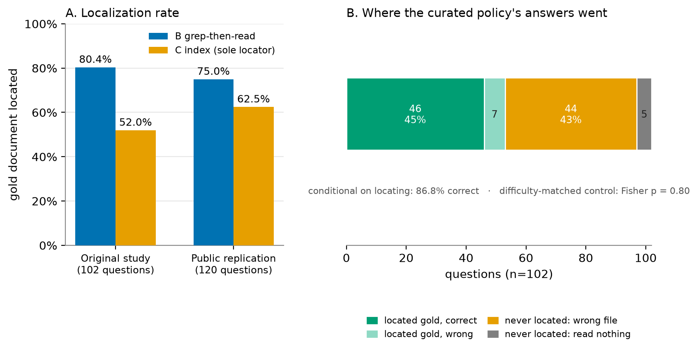

# Reading More, Finding Less: A Pre-Registered Anatomy of Progressive Disclosure for AI Agents

**Rashid Azarang**

*Independent Researcher — San Pedro Garza García, Nuevo León, Mexico*
*rashid@mentu.ai · rashidazarang.com · ORCID [0009-0008-5528-4246](https://orcid.org/0009-0008-5528-4246)*

**Preprint — 2026-08-15.** This text was hardened against two commissioned
adversarial reviews (2026-07-22, 2026-08-12) and six further external
audits (2026-08-14 through 2026-08-16: two prior-art audits, one audit
paired with an independent reproduction of the shipped replication bundle,
and a three-round artifact-consistency audit); every citation
and arithmetic claim in those reviews was verified against the committed
artifacts and the cited sources before any finding was adopted, and each
audit is dispositioned finding by finding in the research repository,
which also carries this text's complete dated change history and audit
dispositions; the repository is unpublished (§Data & artifact
availability) and access is available under its confidentiality terms. No
frozen conjecture, analyzer, results document, or effect table was altered
in any revision; revisions re-report what those artifacts already contain,
at corrected prominence, and add descriptive statistics computed from
committed run records. Built from the pre-registered falsification program
`docs/BUILD-agent-memory-allocation-v1.md` in the `epistemics` research
repository; §-content derives from that program's committed spine (see git
history of this file). A production client engagement referenced in §3–§5 is
generalized throughout as **Workspace-P** with its identity and contents
withheld; the confidentiality boundary and the data-release options are
documented in `SENSITIVITY-AUDIT.md` and §Data & artifact availability.

## Abstract

Whether curated progressive disclosure helps or hinders an agent that could
instead search is now measured by several groups. Published designs measure
their curated arms by aggregate outcome (answer quality and token cost)
without per-read telemetry, so when a curated arm underperforms, the failure
cannot be attributed to the index's routing; the closest preregistered
neighbour records aggregate usage only and names direct read telemetry as a
target for replication. This paper supplies that instrument for the curated
arm. In a
pre-registered comparison over 102 frozen questions on a production corpus, we
strip the search tool from the curated arm, making an authored one-line-digest
index the policy's **sole locator**, and record, per question, whether each
policy reached the gold document, measuring routing and not just accuracy:
the index located the gold document on **52.0%** of questions
against grep's **80.4%**. Of the curated policy's 47 wrong-stops, 43 had read a
wrong file and only 4 had read nothing; the policy issued *more* read events
than the search policy (192 vs 174); and where the index did locate the
document, accuracy was **86.8%**, with a difficulty-matched control
detecting no answerability difference in the questions it failed to route
(Fisher p = 0.80). A policy that
reads more and finds less is not stopping early on summaries. It is being
mis-routed by its index. Downstream, search-then-read beats curated disclosure
on accuracy (72.5% vs 47.1%, +25.5 pp) and on error rate (27.5% vs 52.9%),
and is cheaper on marginal tokens (0.79×) while costing 1.41× on totals; one
prediction's unfrozen measure is disclosed as a defect of the method. A
pre-registered public replication over 141 releasable documents and 120 frozen
questions, under three deliberately harder criteria, returns search **+12.5
pp** on accuracy (63.3% vs 50.8%), the curated arm wrong-stopping on 34.2%
of questions against search's 18.3% under a symmetric rule the original
lacked, and a localization advantage of 75.0% against 62.5%, with 91.1% of
the curated arm's non-hydrated answers wrong (84.0% pooled across both
arms, the frozen form); its overall
verdict is *revised*, machine reason
`headroom_not_established_on_marginal_tokens`. In the same pre-registered
program, promotion of facts to a durable memory directory produced later
returns on 2 of 157 eligible files (*refuted*): the read path fails by
routing; the write path, on its registered population and measured channel,
is rarely read back. Predictions were frozen and
analyzers committed before any data were read; adjudication is mechanical
against criteria fixed in advance; the replication ships its corpus,
questions, harness and adjudicator for byte-identical re-running. We stake one
prediction for external replication, scoped to its substrate: an authored
one-line-digest index over a prose corpus, used as a sole locator, routes
worse than search on that corpus, and its non-hydrated answers are
overwhelmingly wrong. We decline the neighbors: no claim about indexes
used alongside search (an unregistered successor), no claim that the accuracy
margin generalizes across corpora, and the tier-and-policy vocabulary used
throughout is working vocabulary, not a defended thesis.

**Keywords:** context engineering; agent memory; retrieval routing;
progressive disclosure; pre-registration; LLM agents.

*Discipline carried from the governing program and observed throughout: every
quantity cites a source path; no outcome of unadjudicated work is anticipated
(the covered C26/C27 re-runs, the registered-but-unadjudicated successor
conjectures c26b and c28b, the index-plus-search successor, and the candidate
conjecture c30 are pre-judged nowhere); no self-assigned quality score
appears.*

---

## §1 The question and the result

When an agent's only way to find content is an authored index, how often does
the index route it to the right place, and what happens downstream when it
does not? This paper measures that question under pre-registration and reports
the anatomy of the answer. On 102 frozen questions over a production corpus,
an authored one-line-digest index used as a policy's sole locator routed to
the correct document on 52.0% of questions; associative search over the same
corpus, 80.4%. The curated policy read *more* files than the search policy and
found fewer of the right ones; of its 47 wrong answers issued without the
correct document in context, 43 came after reading a wrong file. Where the
index did route correctly, accuracy was 86.8%, indistinguishable from an
oracle approximation, and a difficulty-matched control detects no
answerability difference in the questions themselves (Fisher p = 0.80;
§4.2 states the interval and what it can and cannot carry). The failure of curated retrieval,
where it fails, is a routing failure of the authored layer, not a
comprehension failure of the model and not an early-stopping choice of the
policy. A pre-registered public replication at power reproduces the direction
on a corpus a reader can hold in full (§5).

The comparison itself sits in newly crowded territory. Cochran's preregistered
ablation of progressive disclosure on a frozen 709-page wiki includes an
enforced read-only condition whose tool whitelist blocks corpus-wide search
(agents attempted it on 39 of 320 enforced runs, all blocked) and finds
curated access non-inferior on quality at 30–58% lower cost, while observing
in its unrestricted condition that capable agents bypass the index by
inferring page paths [39]; He et al. compare disclosure designs against a
hybrid retriever across three harnesses and find single-level disclosure
sufficient [40]; grep-based search has been measured against vector retrieval
across harnesses [41]; skill-catalog organization has been measured for
its runtime effects [42]; and direct corpus interaction (an agent searching
a raw corpus with grep, file reads and scripts, no retriever at all) has
been measured against sparse, dense and reranking baselines with a
trajectory-level coverage metric that counts a gold document as surfaced
when it appears in the recorded trace as a retrieved snippet or as a file
returned by a tool call [43]; and the skill-routing literature points
routing telemetry at authored one-line digests at scale: hiding the
digest's body costs 37–44 pp of routing accuracy over ~80K skills [47],
triggering from name-plus-description is unreliable across models and
harnesses [48], and library growth decomposes into wrong selection against
degraded execution [49]. What none of the *document-corpus* curated designs
records is the read level: Cochran's harness "recorded only aggregate
usage," and his paper names direct read telemetry as a target for
replication [39]. Without it, a curated arm's failure cannot be located: it could sit
in the index's routing, the policy's stopping, or the model's
comprehension. The design here brings the read level to that arm
independently (§3; §9's dating note):
per-question gold-file logging on a prose corpus whose authored digest
index is the sole locator, which is what converts "curation underperforms"
into an attribution: the index mis-routes, and the anatomy of its
mis-routing is measurable. §9 maps where every piece of that
instrument already exists in neighboring literatures.

An agent's effective memory is more than its context window: contract files
loaded at boot, catalogs of skills and tools, durable memory directories with
index files, workspace filesystems reachable by search, and structured stores
reachable only through tools, a configured tier whose measured ablations
find weak, largely content-independent correctness effects [11, 60, 61]. The authored index tested here is one tier of
that larger allocation, and the broader question, *what earns which
allocation*, motivates the program this paper reports (§2 supplies the
vocabulary). Within that program, this paper contributes:

1. **The mis-routing anatomy** (§4): read-level telemetry on a
   document-corpus curated arm, the decomposition of its failure into
   located/mis-routed/unread, and a difficulty-matched oracle control
   (unregistered in both studies, computed post-verdict, descriptive;
   §4.2). The
   isolation itself is shared ground: Cochran's enforced arm achieves it
   [39], and skill routing measures the same deficit class on skill
   registries [47]. The anatomy and the control are what this arm adds,
   and both now also re-derive from the public replication's shipped
   records (§5).
2. **A public replication at power under deliberately harder criteria** (§5):
   141 releasable documents, 120 frozen questions, a symmetric wrong-stop
   rule, and a token-headroom prediction frozen on the measure the original
   study's own disclosure said should have been frozen, which then failed,
   making the replication's verdict *revised*.
3. **A write-side result under the same discipline** (§6): in the same
   ecosystem, promotion of facts to a durable memory directory produced later
   returns on 2 of 157 eligible files: *refuted* under frozen criteria, with
   its channel caveat and its evidential weight stated rather than averaged
   into the read-side result.
4. **The method as instantiated** (§7): predictions frozen before data,
   analyzers committed before first output, mechanical adjudication, floors
   enforced against the author's interest, and negative and self-correcting
   results reported as first-class.

It is not a system and not an architecture proposal; every result it reports
was adjudicated mechanically against criteria frozen before any probe ran.

## §2 Vocabulary: tiers, policies, and the metrics of stopping

The measurements below need a small fixed vocabulary, stated once:

> An agent's effective memory is a set of **tiers**, each with (capacity, access
> cost, persistence, addressability, staleness risk), governed by **five
> policies**: **residency** (what loads at boot), **paging** (what's fetched on
> demand), **promotion** (what graduates to durable memory), **eviction**
> (compaction), **validation** (staleness checks).

The five policy names are taken from classical cache and virtual-memory design
[14, 15, 16], and the borrowing is deliberate. Two things are not in that
vocabulary. First, **residency splits into content residency and pointer
residency**: a resident pointer (a name, a one-line digest, an index entry) is
progressive disclosure formalized: the resident pointer is the
low-resolution representation, the paged body the high-resolution one. A cache
line is never a pointer to its own contents, so cache design has no occasion
to draw this line. Second, **staleness risk is a tier property**: OS paging is
faithful, but a digest is lossy, so agent memory admits a resident
representation that silently misdescribes what it stands for. A summary whose
body would have changed the decision is not a smaller copy of the body; it is
a different document that happens to share a topic. That is what makes the
**wrong-stop**, acting on an insufficient representation, a correctness
failure rather than a cost saving, and it is the failure class §4 anatomizes.
The candidate repair (invalidate on write, revalidate on read) is an
economics question that remains open and unregistered (c30; outcome not
anticipated). A two-tier design of this shape (summary index first, a
runtime sufficiency router escalating to the raw store) has since been
built as TierMem [57]; measuring it on this corpus family is the open
registration, not a new idea.

Paging reaches the window by three mechanisms: **pointer-follow** (resolve a
resident pointer: read the indexed file, load the named skill), **associative
search** (grep/glob/semantic search over content with no resident pointer),
and **policy-push injection**, in which the harness itself writes content into
the window at a lifecycle event, a channel invisible to any instrument that
counts only agent-initiated reads, and precisely the un-refuted half of C28
(§6). **Promotion** moves an object to a more durable, more reachable tier;
**eviction** removes by deletion or lossy digest; **validation** detects (or,
commonly, fails to detect) divergence between a stored representation and
ground truth.

| Tier | Definition | Examples (this machine) |
|---|---|---|
| **T0 boot-resident** | auto-loaded every session | `CLAUDE.md`/`AGENTS.md` chain, `MEMORY.md` index body, system-prompt skill/tool listings |
| **T1 pointer-resident** | boot-resident pointer, content paged on demand | `memory/*.md` files, skill bodies, `catalog.json` targets |
| **T2 paged-searchable** | on disk in the workspace, no boot pointer | `notes/`, `docs/`, source files |
| **T3 store-tier** | reachable only through tools/DB | LACS handles, CIR signals |

Tier assignment classifies the *access surface*, not the object: a skill is a
T0 pointer (its catalog line) plus a T1 body. Classification rules for the
measurement program live in the committed analyzers, not in prose
(`docs/BUILD-agent-memory-allocation-v1.md`, Risks).

The formal lineage of disclosure-as-decision is value of information (Howard
1966) and search with inspection costs (Weitzman 1979) [7, 8], imported as
**vocabulary and metrics** and explicitly not as transferable optimality
theorems: document contents are correlated, prize distributions are unknown,
inspections are not exchangeable, and the cost of a resident token is an
attention externality rather than a scalar fee. The usable imports are the
metrics:

- **Minimal sufficient context** C*(τ): the smallest token set whose
  acquisition yields the correct decision for task τ at a stated confidence.
- **Overspend**: tokens acquired ÷ |C*(τ)|.
- **Wrong-stop**: acting on an insufficient representation (deciding from a
  summary whose body would have changed the decision).
- **Oracle regret**: cost difference between the policy and an oracle that
  acquires exactly C*(τ).

The program's tier study develops the frame in full: a four-system
load-test classification (MemGPT, Pichay, the Claude Code harness, and a
production workspace) recorded there as an author-run classification
rather than evidence, a control-plane corroboration, four points where the
OS analogy breaks, and two further tier-return conjectures with recorded
estimates. It is available from the author on request. This version confines the frame to the vocabulary above,
which is all the measurements consume.

## §3 The experiment: registration, arms, and the sole-locator ablation

`corpus/supported/c29-curation-vs-search-sufficiency.md`. Experimental; hard
order gate: harness code + frozen hashed question set + pinned model
identifiers committed before any policy run. Status: adjudicated 2026-07-19 →
**supported**; graduated to `corpus/supported/`, results in §4.

**Claim (frozen):** "For repo-scale retrieval tasks, associative search over
raw content followed by full reads (grep-then-read — the reigning deployed
policy in coding agents) matches curated layered disclosure (authored
frontmatter/summary tiers read cheapest-first) on answer accuracy, at a token
cost within the same order of magnitude — and disclosure pays for its token
savings with wrong-stops: answers issued from a summary tier when hydration
was actually required. If so, the marginal value of authoring and maintaining
resolution layers is small wherever content is greppable, and curation
investment is justified only where associative search is weak (non-textual
content, cross-file synthesis, naming that diverges from content). […] It is
deliberately stated in the search-sufficiency direction — the direction the
return-cliff evidence points — so that a disclosure win refutes it cleanly and
vindicates the curation doctrine deployed in practice."

**Predictions (frozen 2026-07-18):** P1 (accuracy parity): "B's accuracy ≥
C's accuracy − 3 percentage points." P2 (token order): "B's total tokens ≤ 2×
C's unamortized tokens." P3 (wrong-stop tax): "C's wrong-stop rate ≥ B's
wrong-answer rate." P4 (both are far from optimal): "B and C each spend ≥3×
D's tokens — the headroom claim that motivates allocation-policy research
regardless of which policy wins."

**Falsification (frozen):** "C beats B by >3pp accuracy at ≤0.5× B's tokens
(amortized) → refuted: curation is vindicated as dominating, and the paper
must present layered disclosure as the superior policy wherever layers exist.
P1 holds but P2 fails by >5× → revised: search is accurate but
token-profligate; the trade is real and regime-dependent, not a sufficiency.
Question-set contamination discovered (generator leaked summary content, or
any policy run preceded the frozen hash commit) → the run is void; regenerate
under a new dated harness. No partial salvage."

**The four arms.** A loads a flat 100,000-character dump of the corpus. B is
grep-then-read: associative search, then full reads. C is index-then-hydrate:
an authored one-line-digest index resident, bodies read on demand. D is an
oracle approximation: the gold file supplied directly, truncated at 60,000
characters. The realization of C is two-tier by design decision D1 (path plus
one-line digest, then full body), recorded before question generation; the
committed digest instruction caps each line at **140 characters**, so the
staked substrate is per-file digests of at most 140 characters, not
"one-line" loosely.
Authorship of the index, stated plainly: the digests are **model-written**.
C29's index was produced by the pinned generator (`claude-sonnet-5`) at a
recorded cost of 1,307,300 tokens, and C34's 141 digests were written by
the same model under the committed prompt (call ledger, bucket `digest`).
"Authored" in this paper means maintained as deployed practice under a
fixed operator prompt, one line per file; it does not mean hand-written,
and no claim in this paper turns on human authorship. The digest writer
saw frontmatter-stripped bodies truncated at 6,000 characters; the
question generator saw the same stripped bodies at 8,000 (both caps
committed), so the two instruments read overlapping prefixes of the same
source, which is what Limits (b)'s shared-salience note assumes. One
affirmative consequence: the digests were authored for precisely the job
they were measured on — deciding whether to open the file — so the 52.0%
localization is not a strawman of an index built for something else.

**The ablation, defended where it is made.** Arm C's tool set is `Read` only
(`DESIGN.md` D5): the authored index is the policy's **sole locator**. No one
deploys an agent this way, and in unrestricted conditions the situation may
not even arise: Cochran's preregistered wiki ablation observes capable
agents bypassing the index by inferring page paths [39]. Isolation is
necessary for attribution: when the agent can route around the index, a wrong
answer cannot be attributed to it, because the routing that failed may never
have consulted it. Cochran's enforced read-only condition reaches the same
isolation by tool whitelist [39]; isolation alone, however, attributes
nothing, because an isolated arm measured only by aggregate outcome still
cannot separate mis-routing from early stopping from comprehension failure.
What converts isolation into attribution is the record: per-question logging
of whether the policy reached the gold document, the telemetry Cochran's
harness did not capture and his paper names as a target for replication
[39] — a convergence, not a response: his paper was surfaced to this
program only after adjudication (§9, dating note). The ablation plus that record is the design of §4. What is given up is
deployment realism, recorded as a scope condition (§8 Limits (b)); the
deployment-realistic arm (index-plus-search) is a registrable successor, not
run here (§8).

**Procedure.** Order proof by commit chain: DESIGN + harness (`5572eba`) →
question set and index frozen by hash (`5d63e0a`; sha256[:16]
`8f39408f324ffb84` / `c84e20581f36936f`) → first policy run. 102 questions (81
lookup / 21 synthesis; 85 Spanish operational notes / 17 English methodology
docs), every answer mechanically validated as an exact body substring; the
generator (`claude-sonnet-5`) saw frontmatter-stripped bodies only; the
answerer was pinned (`claude-haiku-4-5-20251001`); every call ran
`--no-session-persistence` so the experiment wrote no transcripts into any
future corpus. Two infrastructure retry passes under the committed mechanical
rule (only error-flagged records retried; scored answers never re-rolled): 71
provider session-limit refusals, then 24 subprocess timeouts (cap 420→900s,
concurrency 6→3, amendment committed pre-verdict). Final coverage: **102
scored per policy, 0 errors.**

## §4 Results: the mis-routing anatomy

*Figure 1. The anatomy of curated-retrieval failure under the sole-locator
ablation. Left: localization rate (how often each policy brought the gold
document into context) in the original study (B 80.4% vs C 52.0%, 102
questions) and the public replication (B 75.0% vs C 62.5%, 120 questions).
Right: where the curated policy's 102 answers went in the original study:
located the gold file and answered correctly (46); located it and answered
wrong (7); never located it, having read a wrong file (44); never located
it, having read nothing (5). Conditional on locating the file, C's accuracy
is 86.8%; a difficulty-matched control on the oracle arm detects no
answerability difference in the questions C failed to locate (Fisher
p = 0.80; §4.2 states the interval). The deficit is localization.*

| Policy | Accuracy | Error rate | Marginal tokens | Total tokens | of which cache reads |
|---|---|---|---|---|---|
| A flat-load (100k-char dump) | 2.9%† | 97.1% | 3.46M | 4.93M | 29.7% |
| **B grep-then-read** | **72.5%** | **27.5%** | **1.95M** | 19.48M | 90.0% |
| C index-then-hydrate | 47.1% | **52.9%** | 2.46M | 13.84M | 82.2% |
| D oracle-approx (gold file) | 82.4% | 17.6% | 0.68M | 2.13M | 67.9% |

*† A is budget-bounded, not informative: its dump reached 4 of the 102
files, an attainable ceiling of 3.9% (§4.4).*

Three columns here changed in a prior revision, all from quantities the
committed run records already carried. **Error rate** is added because the
abstract compared B and C on it while the paper reported only C's wrong-stop
rate, which is a subset of C's errors rather than C's error rate; the
apples-to-apples comparison is 27.5% against 52.9% (Fisher p = 0.0003), and it
is stronger than the frozen P3. **The cache-read share** is added because the
two token columns are not on a common price basis without it: marginal tokens
exclude cache reads, and cache reads are 90% of B's total against 30% of A's,
so the two columns rank the policies differently for reasons that have
nothing to do with policy. Marginal tokens are the policy-attributable
measure; totals are inflated by nested-CLI overhead that differs by arm, as
the committed harness notes at the point where it separates the components
(`harness_lib.py:160–167`). **The cost column is withdrawn.** Recorded
per-call `cost_usd` is provider-reported and we could not reproduce it from
list prices (reconstruction gives $4.79/$4.63/$4.77/$1.15 against the
recorded $7.32/$6.00/$6.49/$1.63), so "B is cheapest at $6.00" is not a claim
this table can carry. C's authoring cost stands separately at 1,307,300
generator tokens, reported amortized and unamortized in the effect table as
the frozen text requires.

| Frozen prediction | Threshold | Measured | Outcome |
|---|---|---|---|
| P1 accuracy parity | acc(B) ≥ acc(C) − 3pp | B **+25.5pp** above C | pass |
| P2 token order | tok(B) ≤ 2× tok(C), frozen on **totals** | 1.41× totals; 0.79× marginal | pass |
| P3 wrong-stop tax | C wrong-stop ≥ B wrong-answer | **46.1%** vs 27.5% | pass‡ |
| P4 oracle headroom | B, C each ≥ 3× D; **measure not frozen** | totals 9.1×, 6.5×; marginal **2.85×**, 3.60× | pass on totals, **B fails on marginal** |
| Refutation (C dominates) | >3pp better at ≤0.5× tokens | — | not triggered |
| Revision (search profligate) | P1 ∧ tok(B) > 5× tok(C) | 1.41× | not triggered |

*‡ P3's registered form compares a subset to a superset; §4.3 gives the
symmetric restatement (C 46.08% against B 12.75%), which is the reading to
quote.*

**A defect in the method, disclosed.** P2's frozen text names its measure
("B's **total** tokens ≤ 2× C's unamortized tokens"); P4's does not name one.
Adjudicated on totals, P4 passes at 9.1× and 6.5×. Adjudicated on marginal
tokens, B spends 1,948,295 against D's 683,496, which is **2.85×**, and **P4
fails for B**. The recorded verdict is unaffected either way: C29's frozen
falsification and revision triggers read only P1 and P2, so no P4 reading
could have changed the verdict word. What the episode shows is therefore not
a wrong choice but an underdetermined registration: the measure was chosen
at adjudication time, which is exactly what a program whose contribution is
mechanical adjudication against criteria fixed in advance must not allow,
and this one allowed it. The rule is recorded for the program: freeze the
measure with the threshold. The oracle-headroom claim is reported hereafter as
holding on totals only.

These outcomes are the result **on this corpus**. The released kit's public
demonstrator falls below the frozen scored-question floor and adjudicates
nothing (§8 Limits (b′)).

*Figure 2. Accuracy vs. marginal token cost per retrieval policy (102 frozen
questions, pinned answerer). Grep-then-read (B) is both more accurate and
cheaper at the margin than curated index-then-hydrate (C). D is a
minimal-sufficiency approximation at file granularity, not an upper bound: a
subset of C exceeds it (see below). A is budget-bounded rather than
informative: its 100,000-character dump reached only 4 of the 102 corpus files,
so its attainable ceiling was 3.9%. C's position is paid for by mis-routing, not
by early stopping. Measured on this corpus; the public demonstrator is below the
frozen floor and adjudicates nothing (§8 Limits (b′)). The public replication
(§5) reproduces B's accuracy and localization advantages on a releasable
corpus at power (+12.5 pp; 75.0% vs 62.5% localization), and fails P4's
headroom prediction on marginal tokens, the measure this paper's own
disclosure said should have been frozen.*

### §4.1 Where C's accuracy goes

C answered 49 of 102 questions without ever reading the gold file, and 47 of
those 49 were wrong (96%). An earlier draft read this as the policy trusting
the digest and stopping. **The run records say otherwise, and the reading is
withdrawn.** Of those 49 questions, **only 5 involved reading no file at
all**; the other 44 read at least one file, the wrong one. Of the 47
wrong-stops, 43 read a wrong file and 4 read nothing. Over the full question
set C issued **192 Read events to B's 174**, and located the gold file on **53
of 102 (52.0%) against B's 82 of 102 (80.4%)**. A policy that reads more and
finds less is not stopping early. It is being mis-routed by its index.

### §4.2 The decomposition and the difficulty-matched control

Decomposing C by whether it located the gold file:

| C's behaviour | n | correct | accuracy |
|---|---|---|---|
| never read the gold file | 49 | 2 | 4.1% |
| read the gold file | 53 | 46 | **86.8%** (Jeffreys 95% CI 75.8–93.9) |
| C overall | 102 | 48 | 47.1% |

Conditional on locating the file, C is not worse than B and is not worse than
the oracle approximation. But this conditioning is on the outcome of the thing
under test: C's tool set is `Read` only (`DESIGN.md` D5), so the authored index
is C's sole locator, and "C when it read the body" is "C when the index worked."
The selection is nonetheless characterizable, and it is **not** question
difficulty. On the same 102 questions restricted to C's two subsets, D scores
43 of 53 (81.1%) where C located the file and 41 of 49 (83.7%) where it did not
(Fisher p = 0.80). The null is a failure to detect, not equivalence: the
95% interval on that difference (Newcombe score method) runs from −17.3 to
+12.6 pp, and the
control has little dynamic range this close to D's own 82.4% overall. Its
honest strength is proportion, not proof: the gap it would need to explain
is 82.7 pp (86.8% against 4.1%), and even the interval's unfavorable edge
accounts for about a fifth of that. The control itself is unregistered in
both studies: computed after adjudication, on known outcomes, descriptive
and adjudicating nothing, like every decomposition in §4.1–§4.5. B scores
42 of 53 (79.2%) and 32 of 49 (65.3%). **C's deficit is a
localization deficit of the authored index, not a comprehension deficit and not
a stopping rule.** Two corollaries. First, D is not a ceiling: on the matched
53, C scores 46 against D's 43, because there C holds the gold file plus the
index plus whatever else it read while D holds the gold file alone, truncated at
60,000 characters. The excess is not significant (McNemar exact p = 0.51), and
the frozen conjecture already declared D an approximation rather than true
optimality; only an earlier draft's prose called it a ceiling. Second, the
successor arm suggested by an early-stopping reading (index to locate, always
hydrate) is bounded by these data to at most the 5 zero-read questions, of
which 4 were wrong, giving a maximum attainable 51.0% and leaving B's margin
intact. The arm the data motivate is index-plus-search, and it is a future
pre-registration (§8).

### §4.3 The symmetric comparison

A symmetric wrong-stop comparison, which frozen P3 does not make: P3 as
registered compares C's wrong-stop *rate* to B's wrong-*answer* rate, a subset
against a superset. Applying C's own frozen wrong-stop rule to B (incorrect and
never read the gold file), **B is 13 of 102 = 12.75% against C's 46.08%, a
ratio of 3.6×**. This is descriptive, not adjudicative, and it is a cleaner
statement of the same phenomenon.

### §4.4 Arm A is budget-bounded

Arm validation for A, owed and not previously given. Reconstructing the
flat-load prompt from the frozen manifest and the committed dump builder
(sorted-path order, 100,000-character budget), the dump **reaches 4 of the 102
files**, and the gold answer string is present in it for **4 of 102 questions**.
A's attainable ceiling was 3.9%; it scored 3 of 102, which is 3 of the 4
questions it could possibly answer. The truncation was declared in `DESIGN.md`
D5 ("corpus exceeds it by design") but its magnitude was not reported, and an
earlier draft read A as informative about flat loading. **It is not. A is a
budget-bounded baseline and supports no claim about flat loading**, including
the "useless" characterization removed from Figure 2. P4's headroom claim does
not depend on A and is unaffected.

### §4.5 Regime and language maps

**Regime map** (a report owed by the conjecture's registered limitations): B
beats C on lookup (72.8% vs 49.4%, n=81) *and* on synthesis (71.4% vs 38.1%,
n=21); the hypothesized regime where hierarchy helps synthesis questions does
not appear in this data. The synthesis arm is underpowered at 21 questions and
carries correspondingly less weight than the lookup arm. **Corpus-language
map**, added because the demonstrator's non-reproduction was attributed to it:
on the paper's own 102 questions, B minus C is **+29.4 pp on the 17 English
documents** (B 12/17, C 7/17) and **+24.7 pp on the 85 Spanish ones** (B
62/85, C 41/85). The margin is *larger* on the English slice. Language does
not explain the demonstrator's tie (§8 Limits (b′)). Conjecture graduated to
`corpus/supported/`. Source:
`results/2026-07-19-c29-curation-vs-search-sufficiency.md`.

## §5 The public replication at power (C34)

C29's evidence is 408 run records over a corpus that is 85% third-party client
material and cannot be released. C34 is the successor registered to fix that:
141 releasable documents selected by a frozen mechanical rule, snapshotted at
the byte, 120 confirmatory questions, the same pinned answerer, three arms
(B, C and D; the flat-load arm exited after §4.4 showed it budget-bounded),
and **three
criteria deliberately made harder than C29's**. It was registered
2026-08-12, hours after the commissioned review that invalidated the
flat-load arm; the registration was corrected four times before the first
policy-run call (2026-08-13: treatment prompts pinned byte-verbatim,
factual fixes, degeneracy and index-leak annotations, a non-adjudicating
sensitivity table, none moving a threshold after data existed) and once
after (a bundle-copy redaction changing no threshold, prediction, scoring
rule or verdict); it ran and was adjudicated 2026-08-13/14. Registration
to verdict inside two days is a fact of the order proof, and the ordering
is carried by the commit chain (`c34-study/ORDER-PROOF.md`), not by the
calendar: a symmetric wrong-stop rule,
a token-headroom prediction frozen on marginal tokens (the measure under which
C29's own B would have failed), and an added localization prediction. It was
registered before any harness code, corpus snapshot, question or provider call
existed.

| Frozen prediction | Threshold | Measured (120 questions/arm) | Outcome |
|---|---|---|---|
| P1 accuracy parity | acc(B) ≥ acc(C) − 3pp | B 63.3% (76/120) vs C 50.8% (61/120); **+12.5pp** | pass |
| P2 token order | total(B) ≤ 2× total(C) | 21.99M vs 16.94M | pass |
| **P3′ wrong-stop tax, symmetric** | wrong-stop(C) ≥ wrong-stop(B), identical rule | **34.2% vs 18.3%** | pass |
| **P4 oracle headroom, on marginal** | B, C each ≥ 3× D, **measure frozen** | **1.84×**, **2.73×** (totals 7.56×, 5.82× would pass) | **fail: the verdict's sole cause** |
| **P5 localization advantage** | loc(B) > loc(C); ≥80% of pooled non-hydrated answers wrong, the frozen form | 75.0% vs 62.5%; pooled **84.0%**, 63/75; curated arm **91.1%**, 41/45 | pass |

**Verdict: `revised`**, machine reason
`headroom_not_established_on_marginal_tokens`; adjudicator replays
byte-identical; floors 120/120/120 scored; zero contamination findings
under the committed annotation scope (Limits (b) reports the whole-index
variant)
(`results/2026-08-14-c34-public-curation-vs-search-replication.md`,
shipped in the deposit as `c34-study/RESULTS.md`).

Two descriptive additions re-derive from the shipped run records
(committed data, no new adjudication; both recompute from
`c34-study/runs/`, whose 390 records are the three arms over the 120
confirmatory questions, 360, plus the excluded ten-question smoke set over
the same arms, 30; the shipped question file carries 141 questions, the
remaining 11 generated but never selected by the salted split and never
run, marked `unused` in the file). First, **the anatomy replicates in public**: of the
curated arm's 45 non-located questions, 42 had read a wrong file and 3 had
read nothing (C29: 43 and 4 of 47); conditional on locating the gold file,
the curated arm scored 76.0% (57 of 75); and the difficulty-matched
control transfers, with the oracle arm scoring 77.3% (58 of 75) on the
questions the index routed and 84.4% (38 of 45) on the questions it failed
to route (Fisher p = 0.48; Newcombe 95% interval −20.3 to +8.4 pp — a
failure to detect, bounded exactly as §4.2 bounds its C29 counterpart).
§4's headline contribution is
therefore re-derivable from public data, not only from the withheld C29
records. Second, **P5's denominators, named**: the frozen rule pools
non-hydrated answers across both arms (63 of 75 wrong, 84.0%);
arm-specific, the curated arm's non-hydrated answers were wrong on 41 of
45 (**91.1%**) and search's on 22 of 30 (73.3%). The pooled form is the
registered one; the arm-specific form is what the staked prediction's
"its" refers to, and it is the stronger of the two. On the
commensurability §4 established for token columns, C34's cache-read
shares are 91.0% of B's 21.99M total, 82.6% of C's 16.94M, and 62.9% of
D's 2.91M.

Three things follow, and the third is the one the program owes itself.

First, **the curation-vs-search finding replicates on a corpus a reader can
hold in full**, at +12.5 pp rather than +25.5 pp: a smaller effect on a
different corpus, in the same direction, under stricter rules.

Second, **the symmetric wrong-stop rule vindicates the correction it
encodes.** C29's original P3 compared C's wrong-*stop* rate against B's
wrong-*answer* rate, a subset against a superset. On C34's data that
asymmetric form would have read C 34.2% against B 36.7%, making the curated
index look *better*; the symmetric rule shows it wrong-stopping at nearly
twice B's rate. The original comparison did not merely understate the tax. On
this corpus it would have reversed the reading.

Third, **the defect this paper disclosed above is exactly what failed.** §4
recorded that P4's measure was not frozen and that the outcome flipped with
the choice, and set the rule: freeze the measure with the threshold. C34 did
so, chose marginal tokens (the harder reading, the one C29's B failed), and
P4 failed again, at 1.84× and 2.73× against the 3× bar. A prediction that fails
under a measure fixed in advance is a finding; the same prediction passing
under a measure chosen afterward would have been an artifact. The verdict word
is `revised` because of it, and the curation-vs-search answer is reported at
equal prominence beside that word rather than beneath it.

## §6 The write-side result: promoted memory is rarely read back (C28)

The read-side result above has a write-side counterpart in the same
ecosystem, measured under the same discipline. C28 asked whether facts promoted into a
durable memory directory (the write-allocate policy of §2, and standard
practice in deployed agent harnesses) are ever read back.
`corpus/refuted/c28-promotion-lane-returnability.md`; predictions frozen at
the program registration (`4b86195`, 2026-07-18); adjudicated 2026-07-18 →
**refuted**.

Population per the frozen definition (≥30 days of post-creation corpus, ≥10
eligible same-project sessions): 157 files; the ≥100 floor passed. Measured:
**2 of 157 files ever re-read (1.27%)** against P1's ≥25%; median
eligible-session read rate **0.0%** against P2's ≥1%. The frozen refutation
trigger (ever ≤10% AND median ≤10× T3) fired; the conjecture is refuted and
graduated to `corpus/refuted/`. The headline count is **2 of 157**, on the
registered population; of the full 453-file corpus, the remaining 296 files had
not met the frozen eligibility rule and were not yet testable, and the claim
does not extend to them. The program's tier study reports 43 of
the same 453 objects as ever-exercised under a
looser frozen measure belonging to a different conjecture; the two numbers
describe the same files under two different frozen definitions and are never
pooled. The indexed-vs-orphan contrast (P3) read 2.25% (2 of 89 indexed) vs
0.0% (0 of 68 orphans). Mechanically this passes P3 as registered: the frozen
not-evaluable branch fires below 20 orphans and the corpus holds 68, so the
analyzer's recorded ratio (`inf`) clears the ≥3× bar. The pass carries no
information. The ratio is undefined at an orphan numerator of zero, the whole
contrast rests on **two readers against none**, and Fisher's exact test on the
2×2 table gives **p = 0.51**. It is reported because it was registered, and it
should be read as an untested prediction rather than a confirmed one.

Channel caveat, recorded and non-exculpatory: the registered limitations
declared that the tool-Read channel undercounts (index-only recall and harness
reminder injection are invisible to it) and accepted that bias as running
against P1/P2, so the refutation stands under the frozen terms; the analyzer
counted **18,780 non-tool mentions** of memory files against 2 tool reads,
making injection-channel returnability a registrable successor. That successor
is now **registered** (c28b, registration commit `5cdebb9`, 2026-07-22),
forward-adjudicated after its boundary and measured by channel-agnostic
content-fingerprint reuse; a feasibility probe first ruled out the
injection-event instrument, since the push channel is largely non-persisted;
its outcome is not anticipated here, and a refutation would generalize C28's
result to both channels. One recorded honesty note: the conjecture's single
motivating instance occurred in this program's own excluded session: the
example was the observer. Source:
`results/2026-07-18-c28-promotion-lane-returnability.md`.

Read together with §4, the two results point the same way: on the read path,
the authored routing layer sends the agent to the wrong content; on the write
path, the durably stored content is rarely routed to at all. Their evidential
weights, however, are not comparable, and this paper does not average them.
The read-side result rests on 408 committed run records and a powered public
replication; the write-side result is a single tool-Read-channel measurement
on a transcript corpus that no longer exists (§8 Limits (g)), with 18,780
non-tool mentions unadjudicated pending the registered c28b successor. The
direction is convergent with published evidence on a different substrate:
Yuan et al. find accuracy nearly insensitive to write strategy while
retrieval dominates [12]. C28 stands as a frozen refuted verdict under its
registered terms and channel caveat, no more and no less.

## §7 The method as the instrument

Pre-registration of computing experiments is not new, and this paper does not
claim to import clinical norms into systems research: registered reports [27],
the HARKing analysis and preregistration protocol for CHI experiments [28], the
preregistration literature more broadly [29, 30], reproducibility programs at
ML venues [31], and per-method empirical standards for software engineering
[32] all predate it. What is offered as a contribution is the specific
combination, instantiated end to end: analyzers committed before their first
output; corpora frozen by content hash; the commit chain as order proof; retry
rules that never re-roll a scored answer; floors enforced even when the seen
estimates favored the registered predictions (twice); and seen estimates
permanently disqualified from justifying later floor changes. The program
scoreboard across its registered conjectures: one supported (C29, §4), one
refuted (C28, §6), one replication adjudicated `revised` under deliberately
harder criteria (C34, §5), and, in the program's tier study, two
instrument-insufficient probes whose estimates are on record and barred from
adjudicating anything.

One exhibit shows the discipline earning its keep, and it is restored here
from the program's tier study because it argues for the method better than
any passing result. The tier program's most prominent negative result (the
recorded inversion in which searchable content out-returned pointer-resident
content) was found by a post-hoc diagnostic to be substantially an
edit-channel artifact: 73.5% of the searchable-tier objects were edited
in-window against 9.5% of the pointer-tier files, 21 of 23 exercised
searchable-tier files were exercised *only* by sessions that also wrote them,
and with the channel excluded both tiers collapse toward zero, so the
contrast stops being evaluable rather than reversing. The diagnostic then
disclosed its own bound in the direction that mattered: running on the 341
surviving transcripts it recovers 70% of the frozen searchable-tier
exercised files but only 26% of the pointer-tier ones (an under-recovery
that flatters the deconfounded reading), and under the program's rules it
amends no verdict and can justify no floor amendment. A program that finds
the confound in its own headline negative result, quantifies it, and then
reports that the quantification is biased toward its own correction is the
concrete content of "the gauge, not the policy, is the deliverable." The
full treatment is in the program's tier study (available on request);
every load-bearing quantity from that exhibit appears above.

Two parts of that discipline are worth naming honestly. The adversarial
reviews this manuscript was hardened against were commissioned by the author
(2026-07-22 and 2026-08-12, dispositioned finding by finding in the
research repository). C29 has survived an adversarial
review that set out to refute it, and did not survive unchanged: the review
correctly identified that the paper's public demonstrator fails the frozen P3,
and prompted the decomposition that replaced an early-stopping account of
§4's mechanism with mis-routing and invalidated the flat-load arm. But
commissioned reviewers do not carry independent stakes, so the
independent-stake condition is still unmet. Second, one refuted conjecture's
motivating example was identified as observer contamination and recorded as
such (§6); the same issue recurs for the 17 epistemics methodology documents,
which serve simultaneously as C29's English arm, the public demonstrator's
entire corpus, and measured objects in the program's tier probes. These
are the documents in which this program was being written, during the window
in which it measured them, by the operator whose behaviour is the unit of
analysis. That is disclosed in Limits (h) rather than defended.

## §8 Discussion, practice, and limits

**What the anatomy licenses, and what it does not.** The verdicts license no
configuration change by themselves. Under the program's standing rule (no
threshold is recommended before the data that would justify it exists), the
two data-backed candidates are queued as **future pre-registrations**, each
requiring its own frozen predictions and its own gauge before any behavior in
the estate changes. The first candidate was once stated as "retiring digest
authoring for greppable corpora." What C29 tested is an authored
one-line-digest index used as a policy's **sole** locator, against grep as a
sole locator; C had no search tool at all. The finding is that authored
digests route worse than grep (52.0% against 80.4%), not that digests are
worthless alongside grep, which was not tested. The candidate is re-scoped
accordingly. The second candidate, redesigning or retiring the
memory-promotion lane, rests on C28's refutation (§6) and is unaffected.

**The arm not run, and why not running it is the method.** The comparison a
reader will ask for first is index-plus-search: the deployment-realistic arm
in which the index is advisory and search remains available. That arm is
**unregistered**. Running it now, on this corpus, with these questions, after
these results, would be a post-hoc comparison of exactly the kind this
program's discipline exists to preclude: its numbers would carry the
appearance of adjudication with none of its guarantees, and the choice to run
it would itself be conditioned on the outcomes reported above. The omission is
deliberate. Index-plus-search is named as the registrable successor; its
predictions will be frozen before any run; and its outcome, including the
possibility that an advisory index recovers everything the sole-locator index
loses, is not anticipated here. §4.2 bounds what these data can say about
one member of that family (index-to-locate, always-hydrate: at most 51.0% on
this corpus) and says nothing about the rest.

**The capability confound, named as live.** The divergence from Cochran's
headline is not yet attributable. His preregistered ablation ran Claude Opus
4.8 and found curated access non-inferior on quality at 30–58% lower cost;
this paper's pinned answerer is Haiku 4.5, a weaker tier, and the curated arm
lost by 25.5 points. His discussion predicts the opposite interaction:
"weaker agents should benefit more because they cannot route around a
monolithic index" [39]. So capability alone, in his predicted direction,
does not explain the two results. But the studies also differ in corpus,
question generation, access design (his retrieval-tool arm against this
paper's index-only C), and outcome instrument, so the confound is live, not
resolved: what these two results jointly measure (indexes, or model tiers)
is undetermined. Read-level decomposition at scale points the same way:
across 16,758 coding-agent trajectories, 60–69% of capable models' failures
reach the correct functions and fail afterward, so localization is not their
binding stage [53]; whether §4's reach-bound regime persists as the
answerer strengthens is exactly what the confound leaves open. The two-model
arm is therefore not a follow-on but the decisive registered successor, and
its outcome is not anticipated here.

C29's wrong-stop anatomy also measures a known failure mode in a new place:
that models issue confident wrong answers rather than abstaining when their
context is insufficient is established for *retrieved* context [26], and what
§4 adds is the same failure measured against an **authored digest** tier,
under pre-registration, with mis-routing rather than non-abstention as the
dominant path.

**Limits.** (a) *External validity*: every measurement comes from one
single-operator ecosystem: one practitioner, one machine, one harness family;
portability is not demonstrated across operators. (b) *C29 scope, carried
verbatim from its results doc*: single-operator corpora with unusually
consistent naming (plausibly favors grep); auto-generated questions skew
locatable-fact (81 lookup / 21 synthesis; the split is reported and B wins
both); D approximates minimal-sufficiency at file granularity; one answerer
model at one capability tier (a stronger answerer might extract more from
digests) and one writer-reader pair (the digests were written by
`claude-sonnet-5`, a stronger model than the answerer that consumed them;
writer capability is an untested lever on routing quality, though one bias
runs against the reported deficit: the digest writer and the question
generator are the same model reading the same bodies, so shared salience
should push digests toward mentioning the queried facts, inflating C's
localization); per the capability-confound paragraph above, the two-model arm is
the decisive registered successor, not assumed either way. Two further scope
conditions: C had no search tool (`DESIGN.md` D5), so the experiment compares
an authored index against grep as **sole** locators and says nothing about an
index used alongside search (§3's ablation defense and the successor
paragraph above); and the tested C is a two-tier realization (path plus a
one-line digest, then the full body), not the four-layer ladder the
conjecture text describes, a design choice recorded in `DESIGN.md` D1 before
the questions were generated.

Every one of these scope conditions survives into C34's public replication,
which shares the operator, the repository family, the answerer and the
harness lineage: what C34 buys is power, public re-runnability and a corpus a
reader can hold, **not** operator diversity, which remains the named next
successor. C34 adds one scope condition of its own, and it generalizes past
this program. Its question-generation prompt was **byte-identical** to C29's,
pinned precisely to keep the two comparable, and on the new corpus the same
prompt produced a 30% sub-three-word gold-answer rate against roughly 5% on
C29's, with three of 120 confirmatory golds so unspecific that the frozen
scoring rule could not fail them, a rate that also violates the generation
prompt's own 3–15-word instruction, so the defect is generator
non-compliance surfaced by the new corpus, not only corpus character. Pinning a treatment string is necessary for
comparability and **not sufficient** for it: a replication that carries a
generator prompt onto a new corpus should measure the resulting question
set's discriminating power before spending its answering budget. C34 flags
the affected questions mechanically and reports two sensitivity analyses;
neither flips any prediction. An independent reproduction of the shipped
bundle (2026-08-15, `DISPOSITION-2026-08-15.md`) adds two measurement
caveats, disclosed at their measured size: the frozen scoring rule is
normalized substring containment with no word-boundary requirement, which
admits two genuine false positives on one question's eight-character hash
prefix (q073), symmetric across arms; and the committed index-leak
annotation is scoped to each gold file's own digest; under a whole-index
scope three further questions carry leaked gold strings (q023, q037, q120),
and on all three the curated arm answered wrongly having located nothing,
so the leak's direction remains against the reported result.

**(b′) The public demonstrator.** The released kit's demonstrator (16
questions over 17 English methodology documents;
`repro-kit/DEMONSTRATOR-RESULT.md`) adjudicates nothing: run against C29's
frozen criteria in the committed adjudicator's own order of operations, it
returns **INSTRUMENT INSUFFICIENT** (16 scored per policy against a floor of
100). Within that, frozen P3 fails and reverses (C's wrong-stop rate 18.75%
against B's wrong-answer rate 37.5%), and under the symmetric rule B and C
are identical at 3 of 16, with identical localization (12 of 16 each). At 16
questions per arm the two-sided Fisher power to detect the paper's own effect
is **19.0%**, and B's 10 of 16 has a Jeffreys 95% interval of **38.3–82.6%**,
which comfortably contains 72.5%, so the demonstrator provides no evidence
against the accuracy margin; it is uninformative about it. Nor is it an
external corpus: its 17 documents are the English half of C29's own corpus,
a **subsample re-run** by the same operator on the same machine, not a
replication. The language explanation an earlier draft offered is disposed by
§4.5: the margin is *larger* on the English slice of the paper's own
questions, so the demonstrator's tie differs by question sampling and
run-to-run variation at n≈16, not by corpus condition. Its record and
addendum stand unchanged and unretracted; its role in the public bundle is
filled by C34 (§5), registered for exactly this purpose. What the
demonstrator does support, at its true strength: the one qualitative pattern
visible in both runs is that C's non-hydrated answers are overwhelmingly
wrong (47 of 49 in the paper, 3 of 4 in the demonstrator).

(c) *Definitional non-commensurability, by design*: the program's frozen
measures differ by conjecture (C28's post-creation return is not C29's
localization), and cross-conjecture comparisons never pool them. (d)
*Tier-assignment ambiguity*: objects straddle tiers (a skill is a T0 pointer
plus a T1 body); assignment classifies access surfaces by committed analyzer
rules. (e) *What kills this paper's claims*: an external replication in which
an authored index used as sole locator localizes as well as or better than
search would refute the staked prediction (§Invitation); the frame-level
falsification criteria of the tier program travel with the program's tier
study (available on request) and are unaffected by this
text's narrower scope; the criteria a reader can hold this text to are the
ones in this clause and the §Invitation prediction. The
paper commits to publishing any such outcome as the result. (f) *What this
spine does not contain*: no store-tier re-measurement (C7/C25 own that tier),
no engine changes, no anticipated outcomes for the covered C26/C27 re-runs,
the registered c26b/c28b successors, the index-plus-search successor, or the
c30 candidate.

**(g) The frozen transcript corpus no longer exists.** Discovered during a
post-verdict diagnostic: **1,996 of the 2,337 transcripts in
`analyses/shared/transcript-manifest-2026-07-18.json` have been deleted from
disk. 341 survive, and all 341 verify byte-exact against their frozen prefix
hashes** (none corrupted, none truncated). All 453 memory files, 102 workspace
files, and 251 skill files survive. This is clean deletion, almost certainly
harness transcript rotation, and it is not a data-integrity failure. It is
worse: it is a permanence failure. C28, and the program's two tier probes,
are **no longer re-derivable from their
own manifests**; their effect tables and results documents stand as the record,
and the inputs are gone. C29 is unaffected, because its evidence is its own
408 committed run records rather than the transcript corpus; C34 is unaffected
and fully re-runnable from its shipped bundle. The lesson generalizes and is
recorded for the program: **hash-freezing proves integrity, not availability;
a manifest is not an archive.**

**(h) Observer contamination beyond the C28 instance.** The 17 epistemics
methodology documents serve simultaneously as C29's English arm, the public
demonstrator's entire corpus, and measured objects in the program's tier
probes, and they are the documents in which this program was
written
during the window it measured. The demonstrator role makes the public
reproduction record non-independent (Limits (b′)).

## §9 Related-work boundary

One dating note before the map: C29 was registered 2026-07-18 and
adjudicated 2026-07-19. [40] first appeared two days after the
registration, [54] and [60] in late July 2026, and
[48] in August 2026: contemporaneous work this
paper responds to, not prior art it overlooked. Cochran [39] appeared
twelve days before the registration but was unknown to this program until
an external audit surfaced it on 2026-08-14, a month after adjudication:
the two designs specified the same read-level instrument independently,
and his naming of that telemetry as a replication target was found after
the fact. The boundary is drawn against the literature as of this text's
date.

- **Yuan et al.** [12] (arXiv:2603.02473): diagnoses retrieval-versus-
  utilization bottlenecks in LLM agent memory and reports that "performance
  breakdowns most often manifest at the retrieval stage rather than at
  utilization," with accuracy spanning ~20 points across retrieval methods
  against 3–8 across write strategies, and raw chunked storage matching
  costly lossy alternatives. Occupies: the stage-attribution direction (the
  binding stage is retrieval) and a write-side insensitivity result that is
  convergent with §6's direction on a different substrate. Does not: the
  authored-digest substrate (its retrieval arms are retriever methods, not an
  authored index as sole locator), per-question read-level attribution, the
  mis-routing anatomy, or pre-registration. §4's conclusion is therefore
  convergent with published evidence at the stage level; what this paper
  claims is the substrate, the instrument, and the anatomy, not the
  direction.
- **Cochran** [39] (arXiv:2607.04576): a preregistered ablation of progressive
  disclosure on a frozen, LLM-maintained 709-page wiki, page bodies
  byte-identical across arms, in a 4×3 design whose enforced condition is
  read-only under a tool whitelist (agents attempted corpus-wide search on
  39 of 320 enforced runs, all blocked). Finds targeted access cutting cost by
  roughly a third to a half with quality non-inferior within preregistered
  margins, and observes, in the unrestricted condition, capable agents
  bypassing the index by inferring page paths. Occupies: the preregistered
  disclosure ablation at scale, isolation by enforcement, the bypass
  observation, and the cost result. Does not: record the read level (the
  harness "recorded only aggregate usage," and the paper names direct read
  telemetry as a target for replication), so it has no localization rates, no
  wrong-stop decomposition, and no difficulty-matched control. The relation
  is complementary and explicit: §4 is, independently, the measurement
  Cochran's replication
  target describes, on a different corpus, with an opposite-signed headline
  whose candidate explanations §8 confronts (dating note above).
- **He et al.** [40] (arXiv:2607.17598): raw-document navigation and several
  Agent-Skills pack designs against a classical hybrid retriever across three
  agent harnesses; finds single-level disclosure sufficient, with added
  routing levels providing no benefit. Occupies: the disclosure-depth
  comparison across harnesses. Does not: sole-locator isolation, wrong-stop
  measurement, or pre-registration. Convergent with this paper's two-tier
  realization of C (D1) and with routing depth as a cost rather than a
  benefit.
- **Sen et al.** [41] (arXiv:2605.15184): grep against vector retrieval
  across agent harnesses; grep generally wins, harness-dependently. Occupies:
  the search-tool comparison inside harnesses. Does not: compare search
  against *authored curation*; the B-versus-C comparison of §4 is orthogonal
  to grep-versus-vector, and the two results compose rather than compete.
- **Li et al.** [43] (arXiv:2605.05242): direct corpus interaction (an
  agent searching a raw corpus with grep, file reads and lightweight
  scripts, no embedding model, vector index or retrieval API) against
  sparse, dense and reranking baselines, with trajectory-level
  **coverage**: a gold document counts as surfaced when it appears in the
  recorded trace as a retrieved snippet or as a file returned by a tool
  call. One vocabulary caution before any comparison: what this paper
  calls localization (whether the policy reached the gold document)
  maps to their *coverage*; their *localization* is a different,
  within-document quantity, how tightly a trajectory narrows to the
  evidence span inside an already-surfaced document. Two of their results
  bear here, and they come from different agents and samples. The win
  decomposition (DCI-Agent-CC, Sonnet 4.6 backbone, all 830
  BrowseComp-Plus questions) parallels §4's failure decomposition: of 176
  DCI wins over the retrieval agent, only 34 involve no gold document the
  baseline had surfaced. The lite-agent comparison (DCI-Agent-Lite,
  GPT-5.4 nano, a 100-question subset) wins by 28 points on accuracy with
  *lower* mean gold coverage than the embedding retriever (28.0 vs 56.7;
  coverage-any 70.0 vs 74.0). Their attribution is the mirror image of
  §4's: DCI's advantage "does not primarily come from surfacing more gold
  documents," with the largest gains in converting surfaced evidence into
  fine-grained local search and verification: post-reach resolution
  binds. In §4, reach binds: the curated arm's failures are
  overwhelmingly mis-routes (43 of 47), and where the index did route,
  comprehension held (86.8%). The two attributions are not in conflict
  once the designs are compared: their agent can always iterate, so a bad
  first hop is recoverable; C has no search tool, so a mis-route is
  terminal. Reach binds when there is no recovery path; post-reach
  resolution binds when there is. Which regime an *advisory* index sits
  in is exactly what the registered index-plus-search successor would
  discriminate (§8), and its outcome is not anticipated here. Occupies:
  per-question trajectory gold-reach on raw corpora, and the
  grep-versus-retriever comparison. Does not: authored curation anywhere
  in the design (no arm consults an authored digest index), and no
  pre-registration, no symmetric wrong-stop rule, no difficulty-matched
  control.
- **Context-retrieval benchmarks**: **ContextBench** [44] scores coding
  agents' explored context against human-annotated gold at file, AST-block
  and line granularity along the trajectory; its finding that
  substantial gaps separate explored from *utilized* context, with heavier
  scaffolding yielding only marginal retrieval gains, is the published
  cousin of §4's located-but-answered-wrong bucket; **HippoCamp** [45]
  scores evidence retrieval against ground-truth evidence file sets by
  file hit rate, recall and F1; **SWE-Explore** [58] scores repository
  exploration against line-level ground truth derived from solving
  trajectories, and **CORE-Bench** [59] benchmarks code retrieval for
  agentic coding at scale; file-level localization scoring is standard in
  issue-localization work descending from Agentless [35], e.g. OrcaLoca's
  File Match Rate and Function Match Rate [46]. Occupies: gold-reach
  instrumentation as benchmark infrastructure. Does not: point any of that
  instrumentation at an authored digest index over a document corpus.
- **Agent-skill routing**, the nearest occupied substrate. A skill
  registry under progressive disclosure is a set of authored one-line
  digests whose bodies are paged on demand: structurally, arm C's object
  class (there as elsewhere, "authored" names the maintained digest layer,
  not hand-writing, §3). **SkillRouter** [47] measures routing accuracy over
  ~80K skills and finds that hiding the body costs 37–44 pp, with
  body-distilled-description and metadata-only controls locating the
  missing signal in the body itself: the same sign as §4's deficit, at
  three orders of magnitude more digests, published nearly four months
  before C29's registration.
  **Skill-Use** [48] benchmarks skill use under progressive disclosure
  (the agent sees name and short description only and must retrieve the
  body) with a per-task trigger facet, and finds reliable triggering out
  of reach across eight models and two harnesses. **More Skills, Worse
  Agents?** [49] decomposes the degradation from growing an authored
  library into *skill shadowing* (wrong selection) against *context
  overhead* (right selection, degraded execution), a
  selection-versus-execution attribution adjacent to §4's
  located-versus-comprehension split. Occupies: authored-digest routing
  telemetry at scale, with controls this paper has no analogue for. Does
  not: a prose document corpus (skills are procedures with executable
  bodies, and routing failure surfaces as a wrong or missing tool
  invocation, not as a wrong-document answer delivered with full
  confidence); no oracle-arm difficulty control; no pre-registration; no
  wrong-stop rule.
- **Opposite-signed and boundary results for indexes as locators.**
  **Code Isn't Memory** [50]: a *derived structural* index of a codebase
  inside a coding agent yields a large within-harness localization gain
  over the same harness without it, and against a separate agentic-grep
  baseline claims non-regression at lower cost per solve, counter in
  sign to §4 on a different index class and corpus. **The Library
  Theorem** [51]: indexed external memory beats sequential scanning
  exponentially in theory and by 5× against near-optimal search in a
  controlled lookup experiment. **Don't Retrieve, Navigate** [52]:
  navigation over a distilled digest hierarchy beats flat retrieval on
  single-domain corpora with a recoverable taxonomy and loses on
  open-domain factoid pools, a boundary condition this paper's
  single-corpus-family data cannot test. Together these bound the staked
  prediction: it is a claim about one-line digests over a prose corpus
  used as a sole locator, not about indexes as a class (§8, §10); the
  operative contrast with [50] is index form and corpus (per-file prose
  digests against a structural code graph), not authorship, since this
  paper's digests are model-written (§3).
- **SkillJuror** [42] (arXiv:2606.11543): measures how the organization of
  skill packs changes runtime behavior. Occupies: resident-catalog
  organization effects. Adjacent to the configured-tier questions of the
  program's tier study; no return-rate measurement.
- **MemGPT / Letta** (arXiv:2310.08560): virtual context management: paging
  between a bounded window and external storage, driven by the model's own
  function calls. Occupies: window paging as architecture. Does not: measure
  utilization of what it pages, or validate staleness.
- **MemOS** (arXiv:2505.22101) and **AIOS** [33]: memory-as-OS at system
  scale. Occupies: the OS framing and lifecycle machinery. Does not:
  utilization measurement.
- **Pichay** (Mason, arXiv:2603.09023): demand paging for context windows;
  measures 21.8% structural waste *inside* windows across 857 sessions.
  Occupies: window-tier waste measurement and paging mechanics. Does not:
  tiers above/below the window.
- **CoALA** (arXiv:2309.02427): taxonomy of agent memory by content type.
  Orthogonal axis: CoALA classifies *what kind of thing is remembered*; the
  vocabulary of §2 classifies *where it sits and what that position costs*.
- **Mei et al.** (arXiv:2507.13334): the context-engineering survey; owns the
  term and the taxonomy of window-construction techniques. The window is the
  object of engineering; the substrate underneath is out of scope.
- **ACE** (arXiv:2510.04618): evolves the prompt payload itself. Engineers
  the resident content; does not address routing to anything outside it.
- **Memory systems that fill the validation slot**: **MemoryBank** [17],
  **Mem0** [18], **A-MEM** [19], **Generative Agents** [20].
- **Sufficient context** [26]: formalizes whether retrieved context suffices
  to answer, independently of whether the answer is correct, and reports that
  strong models issue incorrect answers rather than abstaining when it does
  not. This is the nearest published statement of §2's minimal sufficient
  context C\*(τ) and of §4's wrong-stop finding, and it is prior. What §4
  adds is the same failure measured on an **authored digest** tier rather
  than a retrieval tier, pre-registered, with mis-routing rather than
  non-abstention as the dominant path. Anchored confabulation [56]
  sharpens the mechanism: partial evidence *non-monotonically amplifies*
  confident wrong answers, the direction in which §5's
  non-hydrated-wrong figures sit (91.1% on the curated arm; 84.0% pooled
  under the frozen rule).
- **RAPTOR** [34]: recursive abstractive summary trees over a corpus,
  retrieved at multiple levels. The operative difference is purpose and
  measurement, not hand versus machine (C29's digests are themselves
  model-written, §3): RAPTOR's layers are derived and optimized for
  retrieval quality, while C29's index is a maintained practice artifact
  whose committed prompt asks for exactly the routing artifact under test
  ("a one-line summary (max 140 characters) of what this document is and
  contains, useful for deciding whether to open it") and was never tuned
  against retrieval outcomes — no evaluation loop, no query set — and the
  measurement is wrong-stops and end-answer accuracy against an oracle
  approximation.
- **Search-then-read sufficiency**: **Agentless** [35] shows simple
  localize-then-repair matching or beating agentic machinery at repo scale,
  and **SWE-agent** [36] shows the search/read interface itself determining
  agent performance. The sufficiency of grep-then-read relative to elaborate
  machinery is an established empirical result, not one this paper
  introduces; the contribution here is the head-to-head against *authored
  curation* under pre-registration, with the index isolated as the router.
- **Residency versus paging economics**: **CAG** [37] and **Xu et al.** [38]
  compare preloading against retrieval on cost and accuracy. These are the
  A-versus-B comparison of §4 in the published literature. Neither has a
  curated-tier arm, neither measures wrong-stops, and neither is
  pre-registered.

Three claims this leaves unoccupied, each stated at the granularity that
survives the closest published neighbor:

1. **The document-corpus anatomy of authored curation, with an oracle
   difficulty control.** Scoring gold-reach is not new at any level:
   retrieval evaluation scores a retriever's returned set against a
   labelled gold set (recall@k is the standard instrument), Yuan et al.
   measure retrieval relevance at the retriever boundary [12], the
   agentic-retrieval literature scores trajectory-level gold coverage of
   an agent's own tool-call reads on raw corpora [43], context-retrieval
   benchmarks score explored context against annotated gold [44, 45, 58,
   59], and the skill-routing literature points routing telemetry at
   authored digest layers at scale [47, 48, 49]. Nor is the deficit's
   direction new: SkillRouter's 37–44 pp body-hiding cost carries the
   same sign, at larger scale, nearly four months before C29's
   registration [47]. What this paper
   contributes on that occupied map is the *document-corpus*
   instantiation with an attribution its neighbors do not carry: a prose
   corpus whose authored one-line-digest index is the policy's sole
   locator; per-question read-level telemetry on that arm; the
   decomposition of failure into located/mis-routed/unread (43 of 47
   wrong-stops had read a wrong file); and a difficulty-matched control
   on an oracle arm detecting no answerability difference in the failed
   questions (Fisher p = 0.80; §4.2 states the interval; post-hoc
   descriptive in both studies, §4.2); the nearest
   analogue we found to that control is
   Agent Retrieval Bench's no-gold and wrong-repository conditions [54],
   which control for presence, not difficulty. A convergence, an anatomy,
   and a control: the claim is staked on this substrate, not on the
   instrument class [43, 44, 45] and not on the isolation, which
   Cochran's enforced arm also achieves [39].
2. **The demonstrated wrong-stop reversal.** Measuring both arms under one
   wrong-stop rule is a correctness requirement, not a discovery, and the
   contribution class (showing that the scoring rule, not the system,
   decides the winner) is occupied: Same Ranking, Different Winner flips
   agent-memory benchmark conclusions on 83.4–94.0% of shared queries by
   switching only the credited target over fixed outputs [55]. What this
   paper adds is the class instantiated on a curated-versus-search
   comparison: under the rule the original study registered, C34's data
   would have *reversed* the reading (§5). Neighboring ablations that
   score "answered without the right content" asymmetrically can check
   their own comparisons against this case.
3. **Mechanical adjudication with byte-identical re-derivation.**
   Pre-registration by itself is not rare here: Cochran registered on OSF
   with a citable DOI (10.17605/OSF.IO/FEKA7), registration provenance
   stronger than this paper's private git chain [39]. What remains rare is
   the pair this deposit ships: a verdict produced by a committed
   adjudicator with no human judgment at adjudication time, and a bundle
   from which every number in §5 re-derives byte-identically, test suite
   included. The claim is that pair, not the registration.

## Data & artifact availability

**Citation convention.** Repository-relative paths in this paper (e.g.
`results/2026-07-18-c28-…`, `analyses/…/effect-table-2026-07-19.json`) refer to
files in the `epistemics` research artifact. The **order proof** for every
pre-registered claim is the git commit chain, timestamped and append-only:
program registration `4b86195` (predictions frozen); the C29 harness and design
`5572eba` preceding the frozen, hashed question set `5d63e0a`
(sha256[:16] `8f39408f324ffb84`) preceding the first policy run; the C29 verdict
`dc5bfca`. A reviewer verifies the ordering from the commit metadata without
access to any withheld content; the deposit ships that chain as
`c34-study/ORDER-PROOF.md` (commit hashes, author timestamps and subjects
for the registration, freeze, run and verdict commits), so a bundle-only
reader can check the ordering without the repository, whose history remains
the authority. One verification asymmetry is stated plainly: C29's raw run
records are withheld with its client corpus (see Confidentiality below), so
§4 is checkable for internal consistency and against committed hashes,
while §5 re-derives from shipped data byte for byte.

**Canonical public record.** This paper's deposit is DOI
[10.5281/zenodo.21959970](https://doi.org/10.5281/zenodo.21959970)
(Zenodo); the concept DOI
[10.5281/zenodo.21938412](https://doi.org/10.5281/zenodo.21938412) resolves
to the current version. **Cite this version DOI**, not the concept DOI,
which is a moving pointer. The repository-relative paths below resolve
inside the deposited bundle.

**The C34 public bundle.** The public replication ships in full and
is the artifact a reader should start from: the 141-document corpus snapshot at
the byte with per-file hashes, the rule-R evaluation log accounting for all 154
candidates with the clause that accepted or rejected each, the 141 frozen
questions with gold answers, the salted
confirmatory/smoke split, the authored index **and the two frozen prompt
strings that produced questions and digests** (committed in
`generate_questions.py`, byte-compared against the registration by
`test_prompts_frozen.py`), all 390 run records and per-attempt
logs, the smoke audit, the effect table, the dated results document, the full
registration chain including every correction, and the harness, adjudicator and
test suite. Re-running `adjudicate.py` reproduces the committed effect table
byte for byte; the bundle's own test suite runs from a plain directory.

One redaction, registered rather than silent: the corpus-selection rule
excludes files mentioning third-party client identifiers, and that token list is
a curated enumeration of exactly those identifiers, three of them personal names
of people not party to this study. The bundle ships the rule with the list
emptied and the sha256 of the canonical list alongside, so anyone holding the
original can prove in one line that it is the same rule; the rule's *effect*
(which files were rejected, by which clause, with hit counts) ships in full. The
enumeration is in any case not re-runnable from the bundle, because it reads the
`epistemics` git tree at `cb73654` and no git history ships. Registered in
`instruments/2026-08-14-c34-registration-correction-v5.md`.

**Confidentiality boundary.** One corpus in the C29 experiment (Workspace-P) is
a third-party client engagement; its documents, the derived question set, the
digest index, and the per-run answer records contain verbatim client
operational content and are **withheld**. The audit of exactly what is and is
not exposed is `SENSITIVITY-AUDIT.md`: the paper's prose, the effect
tables, and the cited results documents carry no client content; the raw
C29 data does. That audit document is itself repository-internal by its own
header (it enumerates the withheld identifiers, so shipping it would
disclose what it protects) and it therefore stays out of the deposit. No part of the client corpus is released with this paper. The
`epistemics` repository itself is **not published**: client content sits in its
committed git history, so no release here can take the form of publishing the
repository. Artifacts are released individually: the paper, its figures, and
`repro-kit/` publicly, and anything else only under appropriate
confidentiality terms.

**Release shape.** The reproducibility package (`repro-kit/`) contains the
harness, the 17 operator-owned English methodology documents as a public
corpus, a public question set frozen by hash before its runs
(`820352e5b0b4b147`), and a reference demonstrator result
(`repro-kit/DEMONSTRATOR-RESULT.md`). Two things must be said about that
demonstrator wherever it is cited. Its 17 documents are the **English half of
the paper's own C29 corpus**, so it is a subsample re-run by the same operator
on the same machine, not an independent replication. And at 16 questions per arm
it falls below C29's frozen 100-question floor, so under the committed
adjudicator it returns INSTRUMENT INSUFFICIENT and adjudicates nothing; within
that, frozen P3 fails and reverses. Both are set out in §8 Limits (b′). The full
102-question result stands on the committed hashes of the withheld set; the
private artifacts are available under appropriate confidentiality terms. Note
also, per §8 Limits (g), that the transcript corpus underlying C28 and the
program's tier probes no longer exists on disk, so those probes cannot
be re-derived by anyone, including the author.

**Invitation to replicate.** The single-operator scope (§8 Limits) is this
paper's sharpest external-validity bound, and the kit is its intended remedy:
`repro-kit/repro_kit.py` runs the full A/B/C/D comparison end-to-end on any
operator's markdown corpus with pinned models and a deterministic
adjudicator (the kit retains arm A for comparability with the original
study; the replication retired it, §5).
We explicitly invite replications, confirming or refuting, and will link
external results from the artifact repository. **Two conditions on any such
run, learned from our own.** Report the scored-question count against C29's
frozen floor of 100 per policy: below it the frozen adjudicator returns
instrument-insufficient, and a 16-question run has roughly 19% power against the
effect reported here. And record, per question, whether the policy read the gold
file, because that single field is what separates the two mechanisms this paper
had to distinguish (mis-routing from early stopping) and it is what we found
an earlier draft had misread in its own data.

The prediction we stake on replication, scoped to its substrate: **an
authored one-line-digest index over a prose document corpus, used as a
policy's sole locator, will route to the correct document less often than
associative search over the same corpus**, and the resulting non-hydrated
answers, measured on the curated arm alone, will be overwhelmingly wrong
(91.1% in the public replication; 96% in the original study). The scope
condition is not decoration;
on other index classes the published sign differs: a derived structural
code index shows a within-harness localization gain and non-regression
against agentic grep [50], indexed lookup beats even near-optimal
sequential search outright [51], and digest hierarchies win precisely where
the corpus taxonomy is recoverable [52]. We do not stake the accuracy
margin, which is corpus- and question-set-dependent; and we do not stake
"the wrong-stop mechanism" in those words, because our own public
demonstrator shows no wrong-stop tax at all once B is measured under the
same rule as C.

## Acknowledgements and lineage

The conceptual object this paper's vocabulary formalizes was not invented
here. The "progressive disclosure" and "epistemic handle" ideas, and the
framing of memory as active infrastructure, come from a 2025 design corpus
(the `mentu-finder` and Epistemic-Science-&-Engineering notes) and a founding
"CIR — memory as infrastructure" specification (2025-06); this paper's
contribution is to de-brand those ideas into measured tiers and policies and to
subject them to falsification. The store-tier return baseline (0.0222%) is
prior work in the same repository (`paper/return-base-rate-paper.md`). The
method (conjectures with frozen predictions, mechanical adjudication, refuted
claims retained) is the standing constitution of the `epistemics` corpus and
follows its sibling papers on evidence-carrying execution and structural waste.
The cross-camp reference seed was assembled during an earlier documentation
audit of the same estate. Per the repository's authorship convention, the
author is sole author and committer.

## References

*Verification: references 1–8 were verified against their primary sources
(arXiv abstract pages; publisher/index records for the two classical entries)
on 2026-07-22; references 10–13 were verified against their arXiv abstract
pages on 2026-07-23 (added after an external adversarial review surfaced them
as prior art); references 14–38 were verified on 2026-08-12, the arXiv entries
against the arXiv API (title, full author list, v1 date) and the non-arXiv
entries against Crossref (title, container, volume, pages, DOI); references
39–42 were added after an external audit (2026-08-14) surfaced them as the
closest contemporaneous neighbors, and were verified against their arXiv
abstract pages on 2026-08-14; references 43–46 were added after a further
external audit (2026-08-15) surfaced the instrumented-retrieval neighbors,
and were verified on 2026-08-15 against their arXiv abstract pages, with the
coverage definition, metric vocabulary, per-agent attribution and
win-decomposition statistics of [43] checked against its full text;
references 47–61 were added after a fifth external audit with an
accompanying independent reproduction report (both 2026-08-15, dispositioned
finding by finding in `DISPOSITION-2026-08-15.md`), and were verified on
2026-08-15 against the arXiv API (title, author list, v1 date), with the
load-bearing quantities of [47], [50], [51], [52], [53], [54], [55], [56],
[60] and [61] checked against their abstracts or full texts. Two
parenthetical author counts in the 14–38 range ([5], [32]) did not survive
re-verification against the live API (author lists drift across arXiv
versions) and are removed rather than re-pinned; the three-round
artifact-consistency audit of 2026-08-16 touched no reference entry, and
its rounds are dispositioned in the repository's dated disposition
documents (the provenance note tallies the full series: two commissioned
reviews, then six audits). Every
reference resolved. Full BibTeX:
`references.bib`.*

*Reference 9 is a live public documentation page and is the one entry in this
list that **cannot be retroactively verified by any party**, including the
author: a live URL with an access date carries no version a reader can pin. It
supports the policy-push injection channel (§2); it should be read as
unchecked. Replacing it with a dated archival capture or a
documentation-repository commit is an open item, recorded rather than
performed here.*

1. L. Mei et al. *A Survey of Context Engineering for Large Language
   Models.* arXiv:2507.13334, 2025. Framing anchor (§9).
2. Q. Zhang et al. *Agentic Context Engineering: Evolving Contexts for
   Self-Improving Language Models.* arXiv:2510.04618, ICLR 2026. Nearest
   payload-evolution rival (§9).
3. T. Mason. *The Missing Memory Hierarchy: Demand Paging for LLM Context
   Windows* (Pichay). arXiv:2603.09023, 2026. Window-tier paging and the
   21.8% structural-waste measurement (§9).
4. C. Packer, S. Wooders, K. Lin, V. Fang, S. G. Patil, I. Stoica, and
   J. E. Gonzalez. *MemGPT: Towards LLMs as Operating Systems.*
   arXiv:2310.08560, 2023. Virtual context management (§9).
5. Z. Li et al. *MemOS: An Operating System for Memory-Augmented
   Generation (MAG) in Large Language Models.* arXiv:2505.22101, 2025.
   Memory-as-OS at system scale (§9).
6. T. R. Sumers, S. Yao, K. Narasimhan, and T. L. Griffiths. *Cognitive
   Architectures for Language Agents (CoALA).* arXiv:2309.02427; TMLR, 2024.
   Content-type memory taxonomy, the orthogonal axis (§9).
7. R. A. Howard. *Information Value Theory.* IEEE Trans. Systems Science
   and Cybernetics, SSC-2(1):22–26, 1966. doi:10.1109/TSSC.1966.300074.
   Value-of-information lineage (§2).
8. M. L. Weitzman. *Optimal Search for the Best Alternative.* Econometrica,
   47(3):641–654, 1979. Search with inspection costs; imported as metrics,
   not as a transferable optimality theorem (§2).
9. Anthropic. *Claude Code hooks reference.* `code.claude.com/docs/en/hooks`,
   accessed 2026-07-22. The public hook API cited for the policy-push
   injection channel (§2).
10. W. Chatlatanagulchai, H. Li, Y. Kashiwa, B. Reid, K. Thonglek,
   P. Leelaprute, A. Rungsawang, B. Manaskasemsak, B. Adams, A. E. Hassan,
   H. Iida. *Agent READMEs: An Empirical Study of Context Files for Agentic
   Coding.* arXiv:2511.12884, 2025. Large-scale census (2,303 files) of the
   configured tier's composition (§1).
11. T. Gloaguen, N. Mündler, M. Müller, V. Raychev, M. Vechev. *Evaluating
   AGENTS.md: Are Repository-Level Context Files Helpful for Coding Agents?*
   arXiv:2602.11988, 2026. Measures the boot tier's task utility; finds it
   frequently unhelpful at >20% added cost (the program's tier study,
   §6.1 there).
12. B. Yuan, Y. Su, K. Yao. *Diagnosing Retrieval vs. Utilization Bottlenecks
   in LLM Agent Memory.* arXiv:2603.02473, 2026. Separates retrieval from
   utilization; finds retrieval dominant (§9).
13. X. Long, Z. Chen, S. Zeng, S. Wang, K. Guo, J. Tang. *MemTrace: Probing
   What Final Accuracy Misses in Long-Term Memory.* arXiv:2606.17328, 2026.
   Per-knowledge-point memory probing (§9).
14. A. J. Smith. *Cache Memories.* ACM Computing Surveys 14(3):473-530, 1982.
   doi:10.1145/356887.356892. Fetch, placement, replacement, and write axes;
   the lineage of §2's policy names.
15. P. J. Denning. *Virtual Memory.* ACM Computing Surveys 2(3):153-189, 1970.
   doi:10.1145/356571.356573. Cited in §2.
16. P. J. Denning. *The working set model for program behavior.* Communications
   of the ACM 11(5):323-333, 1968. doi:10.1145/363095.363141. The direct
   ancestor of "what should be resident before the task arrives" (§2).
17. W. Zhong, L. Guo, Q. Gao, H. Ye, Y. Wang. *MemoryBank: Enhancing Large
   Language Models with Long-Term Memory.* arXiv:2305.10250, 2023.
   Ebbinghaus-inspired decay and reinforcement (§9).
18. P. Chhikara, D. Khant, S. Aryan, T. Singh, D. Yadav. *Mem0: Building
   Production-Ready AI Agents with Scalable Long-Term Memory.*
   arXiv:2504.19413, 2025. Extraction plus consolidation over stored items
   (§9).
19. W. Xu, Z. Liang, K. Mei, H. Gao, J. Tan, Y. Zhang. *A-MEM: Agentic Memory
   for LLM Agents.* arXiv:2502.12110, 2025. Link evolution and memory update
   as new items arrive (§9).
20. J. S. Park, J. C. O'Brien, C. J. Cai, M. R. Morris, P. Liang,
   M. S. Bernstein. *Generative Agents: Interactive Simulacra of Human
   Behavior.* arXiv:2304.03442, 2023. Recency, importance, and relevance
   retrieval scoring plus reflection (§9).
21. N. F. Liu, K. Lin, J. Hewitt, A. Paranjape, M. Bevilacqua, F. Petroni,
   P. Liang. *Lost in the Middle: How Language Models Use Long Contexts.*
   Transactions of the ACL 12:157-173, 2024. doi:10.1162/tacl_a_00638. The
   attention-tax premise (the program's tier study, §4.1 there).
22. M. Levy, A. Jacoby, Y. Goldberg. *Same Task, More Tokens: the Impact of
   Input Length on the Reasoning Performance of Large Language Models.*
   arXiv:2402.14848, ACL 2024. Length degradation at fixed task (the
   program's tier study).
23. Y. Chang, K. Lo, T. Goyal, M. Iyyer. *BooookScore: A systematic exploration
   of book-length summarization in the era of LLMs.* arXiv:2310.00785,
   ICLR 2024. Measured fidelity failures in hierarchically merged summaries;
   the lossy-digest premise (§2).
24. E. Aghajani, C. Nagy, O. L. Vega-Márquez, M. Linares-Vásquez, L. Moreno,
   G. Bavota, M. Lanza. *Software Documentation Issues Unveiled.* Proc. ICSE
   2019, pp. 1199-1210. doi:10.1109/icse.2019.00122. (The
   program's tier study.)
25. E. Aghajani, C. Nagy, M. Linares-Vásquez, L. Moreno, G. Bavota, M. Lanza,
   D. C. Shepherd. *Software Documentation: The Practitioners' Perspective.*
   Proc. ICSE 2020, pp. 590-601. doi:10.1145/3377811.3380405. (The
   program's tier study.)
26. H. Joren, J. Zhang, C.-S. Ferng, D.-C. Juan, A. Taly, C. Rashtchian.
   *Sufficient Context: A New Lens on Retrieval Augmented Generation Systems.*
   arXiv:2411.06037, ICLR 2025. Sufficient context and confident
   non-abstention; **prior art for §2's C\*(τ) and §4's wrong-stop
   framing** (§8, §9).
27. C. D. Chambers. *Registered Reports: A new publishing initiative at Cortex.*
   Cortex 49(3):609-610, 2013. doi:10.1016/j.cortex.2012.12.016. Cited in §7.
28. A. Cockburn, C. Gutwin, A. Dix. *HARK No More: On the Preregistration of
   CHI Experiments.* Proc. CHI 2018, pp. 1-12. doi:10.1145/3173574.3173715.
   Pre-registration of computing experiments with explicit HARKing analysis
   (§7).
29. B. A. Nosek, C. R. Ebersole, A. C. DeHaven, D. T. Mellor. *The
   preregistration revolution.* PNAS 115(11):2600-2606, 2018.
   doi:10.1073/pnas.1708274114. Cited in §7.
30. J. P. A. Ioannidis. *Why Most Published Research Findings Are False.* PLoS
   Medicine 2(8):e124, 2005. doi:10.1371/journal.pmed.0020124. Cited in §7.
31. J. Pineau, P. Vincent-Lamarre, K. Sinha, V. Larivière, A. Beygelzimer,
   F. d'Alché-Buc, E. Fox, H. Larochelle. *Improving Reproducibility in Machine
   Learning Research (A Report from the NeurIPS 2019 Reproducibility Program).*
   arXiv:2003.12206, 2020. Cited in §7.
32. P. Ralph et al. *Empirical Standards for Software Engineering
   Research.* arXiv:2010.03525, 2020. Per-method reporting standards including
   registered reports (§7).
33. K. Mei, X. Zhu, W. Xu, W. Hua, M. Jin, Z. Li, S. Xu, R. Ye, Y. Ge,
   Y. Zhang. *AIOS: LLM Agent Operating System.* arXiv:2403.16971, 2024. A
   second OS-framing system alongside MemOS (§9). Note: first author Kai Mei,
   distinct from reference 1's L. Mei.
34. P. Sarthi, S. Abdullah, A. Tuli, S. Khanna, A. Goldie, C. D. Manning.
   *RAPTOR: Recursive Abstractive Processing for Tree-Organized Retrieval.*
   arXiv:2401.18059, ICLR 2024. Derived rather than authored layers (§9).
35. C. S. Xia, Y. Deng, S. Dunn, L. Zhang. *Agentless: Demystifying LLM-based
   Software Engineering Agents.* arXiv:2407.01489, 2024. Cited in §9.
36. J. Yang, C. E. Jimenez, A. Wettig, K. Lieret, S. Yao, K. Narasimhan,
   O. Press. *SWE-agent: Agent-Computer Interfaces Enable Automated Software
   Engineering.* arXiv:2405.15793, 2024. Cited in §9.
37. B. J. Chan, C.-T. Chen, J.-H. Cheng, H.-H. Huang. *Don't Do RAG: When
   Cache-Augmented Generation is All You Need for Knowledge Tasks.*
   arXiv:2412.15605, 2024. Content residency versus retrieval, priced (§9).
38. P. Xu, W. Ping, X. Wu, L. McAfee, C. Zhu, Z. Liu, S. Subramanian,
   E. Bakhturina, M. Shoeybi, B. Catanzaro. *Retrieval meets Long Context Large
   Language Models.* arXiv:2310.03025, 2023. Cited in §9.
39. T. O. Cochran. *Progressive Disclosure for LLM-Maintained Wiki Knowledge
   Bases: a Preregistered Ablation.* arXiv:2607.04576, 2026. Preregistered
   disclosure ablation on a frozen 709-page wiki; observes agents bypassing
   the index via path inference (§1, §3, §9).
40. Y. He, Y. Zhao, J. Wang, H. Chen. *Is Progressive Disclosure All You Need
   for Long-Context Agents?* arXiv:2607.17598, 2026. Disclosure designs
   against a hybrid retriever across three harnesses (§1, §9).
41. S. Sen, A. Kasturi, E. Lumer, A. Gulati, V. K. Subbiah. *Is Grep All You
   Need? How Agent Harnesses Reshape Agentic Search.* arXiv:2605.15184, 2026.
   Grep against vector retrieval across harnesses (§1, §9).
42. Z. Chen, Z. Guo, B. Huang, B. Lu, J. Lin, Y. Zhou, W. Zhang. *SkillJuror:
   Measuring How Agent Skill Organization Changes Runtime Behavior.*
   arXiv:2606.11543, 2026. Skill-pack organization effects at runtime
   (§1, §9).
43. Z. Li, H. Zhang, C. Wei, P. Lu, P. Nie, Y. Lu, Y. Bai, S. Feng, H. Zhu,
   M. Zhong, Y. Zhang, J. Xie, Y. Choi, J. Zou, J. Han, W. Chen, J. Lin,
   D. Jiang, Y. Zhang. *Beyond Semantic Similarity: Rethinking Retrieval for
   Agentic Search via Direct Corpus Interaction.* arXiv:2605.05242, 2026.
   Trajectory-level gold coverage for direct corpus interaction (§1, §9).
44. H. Li, L. Zhu, B. Zhang, R. Feng, J. Wang, Y. Pan, E. T. Barr,
   F. Sarro, Z. Chu, H. Ye. *ContextBench: A Benchmark for Context
   Retrieval in Coding Agents.* arXiv:2602.05892, 2026. Explored context
   scored against annotated gold at file, AST-block and line granularity
   (§1, §9).
45. Z. Yang, S. Tian, K. Hu, S. Liu, H.-N. Nguyen, Y. Zhang, Z. Guo,
   M. Yu, Z. Zhang, J. Yang, C. C. Loy, Z. Liu. *HippoCamp: Benchmarking
   Contextual Agents on Personal Computers.* arXiv:2604.01221, 2026.
   Evidence retrieval scored against ground-truth evidence files (§1, §9).
46. Z. Yu, H. Zhang, Y. Zhao, H. Huang, M. Yao, K. Ding, J. Zhao.
   *OrcaLoca: An LLM Agent Framework for Software Issue Localization.*
   arXiv:2502.00350, 2025. File Match Rate and Function Match Rate as
   localization metrics (§9).
47. Y. Zheng, Z. Zhang, C. Ma, Y. Yu, J. Zhu, Y. Wu, T. Xu, B. Dong,
   H. Zhu, R. Huang, G. Yu. *SkillRouter: Skill Routing for LLM Agents at
   Scale.* arXiv:2603.22455, 2026. Routing accuracy over ~80K authored
   skill digests; hiding the body costs 37–44 pp (§1, §9).
48. J. Han, Y. Xu, Y. Liao, X. Wang, Z. Jiang, Z. Di, F. Lu, Z. Hu,
   Y. Xiao. *Skill-Use: Can LLMs Actually Use Skills in Agentic
   Harnesses?* arXiv:2608.04828, 2026. Skill use under progressive
   disclosure; per-task trigger telemetry (§1, §9).
49. H. Song, S. Wei. *More Skills, Worse Agents? Skill Shadowing Degrades
   Performance When Expanding Skill Libraries.* arXiv:2605.24050, 2026.
   Skill shadowing against context overhead as a selection-versus-execution
   decomposition (§9).
50. I. Bhola, A. Krishnan, S. Kurmala, M. NS. *Code Isn't Memory: A
   Structural Codebase Index Inside a Coding Agent.* arXiv:2606.22417, 2026.
   Structural code index: within-harness localization gain; non-regression
   against agentic grep (§9).
51. Z. F. Mainen. *The Library Theorem: How External Organization Governs
   Agentic Reasoning Capacity.* arXiv:2603.21272, 2026. Indexed external
   memory against sequential scanning, in theory and experiment (§9).
52. Y. Sun, P. Wei, L. B. Hsieh. *Don't Retrieve, Navigate: Distilling
   Enterprise Knowledge into Navigable Agent Skills for QA and RAG.*
   arXiv:2604.14572, 2026. Corpus navigation over a digest hierarchy; wins
   and losses conditioned on corpus taxonomy (§9).
53. M. Kim, D. Wang, S. Cui, F. Farmahinifarahani, T. Y. Zhuo, S. Garg,
   B. Ray, R. Mukherjee, V. Kumar. *Coherence Collapse: Diagnosing Why
   Code Agents Fail After Reaching the Right Code.* arXiv:2603.24631, 2026.
   Read-level trajectory decomposition at scale; localization not the
   binding stage for capable models (§8, §9).
54. B. Qin, Y. Xie. *Agent Retrieval Bench: Evaluating Repository Context
   Retrieval for Coding Agents.* arXiv:2607.24882, 2026. No-gold and
   counterfactual wrong-repository controls (§9).
55. S. Panthi, R. Abdelfattah. *Same Ranking, Different Winner: How
   Scoring Targets Shape LLM Memory Benchmarks.* arXiv:2605.24060, 2026.
   Scoring-target choice flips benchmark conclusions on fixed outputs (§9).
56. A. B. Lathkar. *Anchored Confabulation: Partial Evidence
   Non-Monotonically Amplifies Confident Hallucination in LLMs.*
   arXiv:2604.25931, 2026. Partial evidence amplifies confident wrong
   answers (§9).
57. Q. Zhu, S. Chen, R. Yu, Z. Wu, B. Wang. *From Lossy to Verified: A
   Provenance-Aware Tiered Memory for Agents.* arXiv:2602.17913, 2026.
   Summary index with runtime sufficiency escalation, the shape of the c30
   candidate (§2, §9).
58. S. Zhang, Y. Wang, J. Liang, Y. Shi, W. Zeng, M. Wang, S. He, N. Xu,
   S. Ye, K. Cai, X. Gu. *SWE-Explore: Benchmarking How Coding Agents
   Explore Repositories.* arXiv:2606.07297, 2026. Exploration scored
   against line-level ground truth (§9).
59. F. Zhang, Y. Zhang, M. Li, D. Long, L. Hu, P. Xie, Z. Zhang,
   F. Zhuang. *CORE-Bench: A Comprehensive Benchmark for Code Retrieval in
   the Era of Agentic Coding.* arXiv:2606.11864, 2026. Code-retrieval
   benchmark infrastructure at scale (§9).
60. P. Khatri. *Do Context Files Help Coding Agents? A Two-Agent Ablation
   Study on Real Repositories.* arXiv:2607.27250, 2026. Authored context
   files do not measurably move correctness (§8).
61. X. Zhang, G. Wang, Y. Cui, W. Qiu, Z. Li, B. Zhu, P. He. *Guardrails
   Beat Guidance: A Large-Scale Study of Rules, Skills, and Persistent
   Configuration for Coding Agents.* arXiv:2604.11088, 2026. Rule-file
   gains are largely content-independent (§8).

`references.bib` additionally carries the retrieval-granularity, agent-memory,
and content-addressed-provenance camps as positioning context; those entries
remain seed-flagged and are not load-bearing for any claim in this draft.
